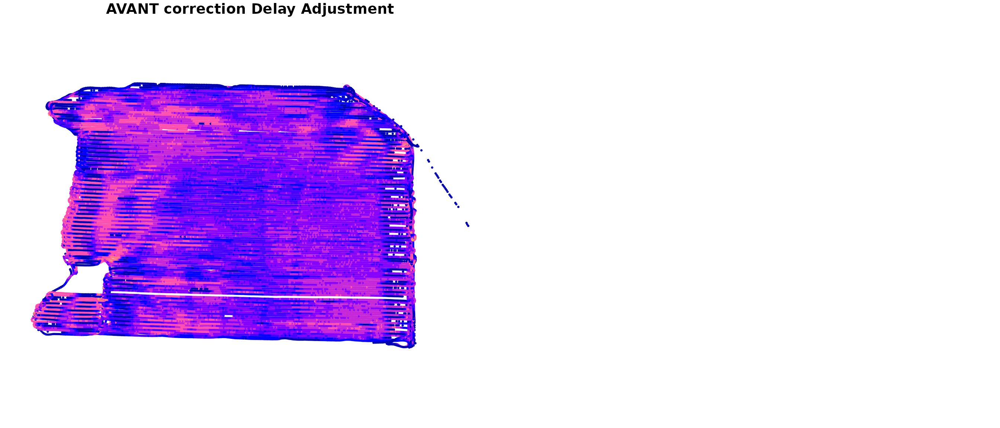
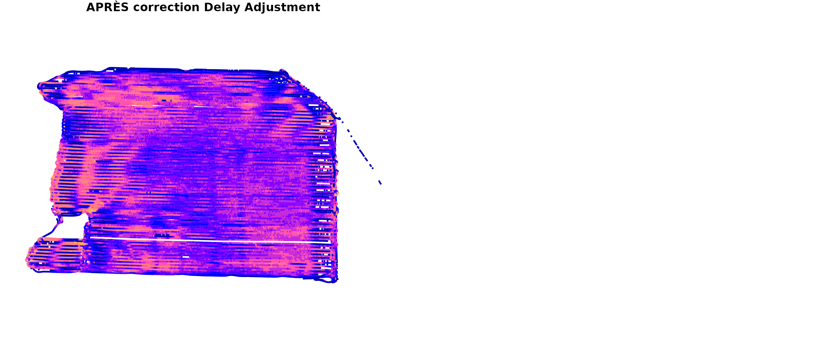
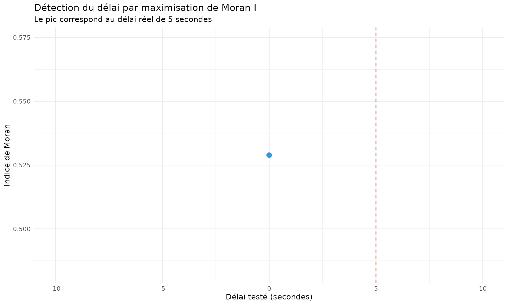

# Filtre Delay Adjustment - Position-Coordinate Delay Identification

## Introduction

Le **Delay Adjustment (Position-Coordinate Delay Identification)** est
un algorithme sophistiqué qui détecte et corrige le délai temporel entre
la mesure du flux de grain et l’enregistrement de la position GPS. Ce
délai, typiquement de 2 à 15 secondes, peut créer des bandes obliques
artificielles dans les cartes de rendement.

### Problématique

Lors de la moisson, le grain passe par plusieurs étapes avant d’être
mesuré : 1. **Coupe** par la barre de coupe 2. **Transport** par la vis
sans fin et les chaînes élévatrices 3. **Battage** dans le cylindre 4.
**Mesure** par le capteur de flux

Ces étapes créent un **délai mécanique** entre le moment où le grain est
coupé (position GPS) et le moment où il est mesuré (flux).

## Fondements mathématiques

### 1. Autocorrélation spatiale

Le Delay Adjustment utilise l’**indice de Moran** pour mesurer
l’autocorrélation spatiale du rendement. L’autocorrélation spatiale
mesure dans quelle mesure des points proches géographiquement ont des
valeurs de rendement similaires.

#### Formule de l’indice de Moran

$$I = \frac{n}{W} \cdot \frac{\sum\limits_{i = 1}^{n}\sum\limits_{j = 1}^{n}w_{ij}\left( y_{i} - \bar{y} \right)\left( y_{j} - \bar{y} \right)}{\sum\limits_{i = 1}^{n}\left( y_{i} - \bar{y} \right)^{2}}$$

Où : - $n$ = nombre d’observations - $y_{i}$, $y_{j}$ = valeurs de
rendement aux positions $i$ et $j$ - $\bar{y}$ = moyenne des
rendements - $w_{ij}$ = poids spatial entre les points $i$ et $j$ -
$W = \sum_{i = 1}^{n}\sum_{j = 1}^{n}w_{ij}$ = somme de tous les poids

#### Interprétation de l’indice de Moran

| Valeur de I   | Interprétation                                   |
|---------------|--------------------------------------------------|
| $I \approx 1$ | Forte autocorrélation positive (zones homogènes) |
| $I \approx 0$ | Pas d’autocorrélation (distribution aléatoire)   |
| $I < 0$       | Autocorrélation négative (zones contrastées)     |

**Objectif du Delay Adjustment** : Maximiser l’indice de Moran en
trouvant le délai optimal qui aligne le flux avec la position.

### 2. Matrice de poids spatiaux

Les poids $w_{ij}$ sont définis par une fonction de distance :

$$w_{ij} = \begin{cases}
1 & {{\text{si}\mspace{6mu}}d_{ij} \leq d_{max}} \\
0 & \text{sinon}
\end{cases}$$

Où $d_{ij}$ est la distance euclidienne entre les points $i$ et $j$ :

$$d_{ij} = \sqrt{\left( x_{i} - x_{j} \right)^{2} + \left( y_{i} - y_{j} \right)^{2}}$$

#### Distance maximale typique

Pour les données de rendement, $d_{max}$ est généralement fixé à **30
mètres**, ce qui correspond à environ 3-4 passages de moissonneuse.

### 3. Décalage temporel (Time Shift)

Pour chaque délai candidat $\delta$, on applique un décalage au flux :

$$Flow_{\delta}(t) = Flow(t + \delta)$$

Le rendement corrigé devient :

$$Yield_{\delta}(t) = \frac{Flow_{\delta}(t) \times Interval}{Swath \times Distance} \times 10000$$

### 4. Score de corrélation spatiale (RSC)

Le RSC (Ratio of Spatial Correlation) est défini comme l’indice de Moran
calculé sur les données décalées :

$$RSC(\delta) = I\left( Yield_{\delta} \right)$$

**Délai optimal** :

$$\delta^{*} = \arg\max\limits_{\delta \in \Delta}RSC(\delta)$$

Où $\Delta$ est la plage de délais testés (typiquement -25 à +25
secondes).

## Algorithme Delay Adjustment

### Pseudo-code

    Delay Adjustment(data, delay_range, n_iterations):
        
        # 1. Conversion en grille spatiale
        grid = create_spatial_grid(data, cell_size=10m)
        
        # 2. Pour chaque itération
        for iter in 1:n_iterations:
            
            # Échantillonnage aléatoire stratifié
            sample = grid_sample(grid, fraction=0.3, seed=iter)
            
            # Pour chaque délai candidat
            for delta in delay_range:
                
                # Appliquer le décalage temporel
                shifted_data = apply_delay(sample, delta)
                
                # Calculer le rendement
                yield = calculate_yield(shifted_data)
                
                # Calculer l'indice de Moran
                moran_score = calculate_moran(yield, distance_threshold=30m)
                
                # Stocker le score
                scores[iter, delta] = moran_score
        
        # 3. Agrégation des résultats
        mean_scores = mean(scores, axis=0)
        std_scores = sd(scores, axis=0)
        
        # 4. Sélection du délai optimal
        optimal_delay = argmax(mean_scores)
        
        return optimal_delay, mean_scores, std_scores

### Implémentation dans yieldcleanr

``` r
library(yieldcleanr)
library(ggplot2)
library(dplyr)

# Charger les données
file_path <- system.file("extdata", "sample2.txt", package = "yieldcleanr")
data_raw <- read_yield_data(file_path)

# Préparation des données (UTM seulement, pas de conversion en rendement)
data <- latlon_to_utm(data_raw)

# Appliquer Delay Adjustment avec plage étendue sur Flow (pas sur Yield)
cat("=== Application du Delay Adjustment ===\n")
#> === Application du Delay Adjustment ===
delay_result <- optimize_delays(data, type = "flow", delay_range = -25:25, n_iterations = 3, noise_level = 0.03)

cat("Délai optimal détecté:", delay_result$delays$flow, "secondes\n")
#> Délai optimal détecté: 13 secondes
optimal_rsc <- delay_result$delay_adjustment_results$flow$rsc_values$mean_score[delay_result$delay_adjustment_results$flow$rsc_values$delay == delay_result$delays$flow]
if (length(optimal_rsc) > 0 && !is.na(optimal_rsc[1])) {
  cat("Score Moran moyen au délai optimal:", round(optimal_rsc[1], 4), "\n")
} else {
  cat("Score Moran moyen au délai optimal: NA\n")
}
#> Score Moran moyen au délai optimal: 0.7919
```

## Visualisation des résultats Delay Adjustment

### Comparaison avant/après correction

``` r
# Données avant correction (converties en rendement pour visualisation)
data_before <- convert_flow_to_yield(data)

# Données après correction (avec conversion en rendement)
data_after <- convert_flow_to_yield(delay_result$data)

# Créer les objets sf
sf_before <- sf::st_as_sf(data_before, coords = c("Longitude", "Latitude"), crs = 4326)
sf_after <- sf::st_as_sf(data_after, coords = c("Longitude", "Latitude"), crs = 4326)

# Graphique comparatif
par(mfrow = c(1, 2))

plot(sf_before["Yield_kg_ha"], main = "AVANT correction Delay Adjustment", 
     pch = 19, cex = 0.3, breaks = "jenks", key.pos = NULL)
```



``` r
plot(sf_after["Yield_kg_ha"], main = "APRÈS correction Delay Adjustment", 
     pch = 19, cex = 0.3, breaks = "jenks", key.pos = NULL)
```



## Exemple illustratif

### Simulation du délai

Pour comprendre l’effet du délai, créons une simulation simple :

``` r
# Créer des données simulées avec un délai connu
set.seed(42)
n_points <- 200

# Trajectoire de la moissonneuse
x <- seq(0, 100, length.out = n_points)
y <- sin(x/10) * 10 + seq(0, 50, length.out = n_points)

# Rendement "vrai" avec pattern spatial
yield_true <- 5000 + 1000 * sin(x/5) + rnorm(n_points, 0, 200)

# Flux mesuré avec délai de 5 secondes
delay <- 5
yield_measured <- c(rep(NA, delay), yield_true[1:(n_points-delay)])

# Créer dataframe
df <- data.frame(
  x = x,
  y = y,
  yield_true = yield_true,
  yield_measured = yield_measured,
  time = 1:n_points
)

# Visualisation
p2 <- ggplot(df, aes(x = x, y = y)) +
  geom_point(aes(color = yield_true), size = 2, alpha = 0.7) +
  scale_color_viridis_c(name = "Rendement\nvrai (kg/ha)") +
  labs(title = "Rendement spatial 'vrai'",
       subtitle = "Pattern régulier sans délai") +
  theme_minimal()

p3 <- ggplot(df, aes(x = x, y = y)) +
  geom_point(aes(color = yield_measured), size = 2, alpha = 0.7) +
  scale_color_viridis_c(name = "Rendement\nmesuré (kg/ha)") +
  labs(title = "Rendement mesuré avec délai de 5 secondes",
       subtitle = "Pattern décalé - bandes obliques artificielles") +
  theme_minimal()

gridExtra::grid.arrange(p2, p3, ncol = 2)
```


### Effet du délai sur l’autocorrélation

``` r
# Calculer Moran I pour différents délais simulés
calculate_moran_simple <- function(yield, x, y, threshold = 10) {
  n <- length(yield)
  y_bar <- mean(yield, na.rm = TRUE)
  
  numerator <- 0
  denominator <- sum((yield - y_bar)^2, na.rm = TRUE)
  W <- 0
  
  for (i in 1:n) {
    for (j in 1:n) {
      if (i != j) {
        dist <- sqrt((x[i] - x[j])^2 + (y[i] - y[j])^2)
        if (dist <= threshold) {
          w <- 1
          numerator <- numerator + w * (yield[i] - y_bar) * (yield[j] - y_bar)
          W <- W + w
        }
      }
    }
  }
  
  I <- (n / W) * (numerator / denominator)
  return(I)
}

# Tester différents délais
delays_test <- -10:10
moran_scores <- sapply(delays_test, function(d) {
  if (d >= 0) {
    y_shifted <- c(rep(NA, d), yield_true[1:(n_points-d)])
  } else {
    y_shifted <- c(yield_true[(-d+1):n_points], rep(NA, -d))
  }
  calculate_moran_simple(y_shifted, x, y)
})

# Graphique
df_moran <- data.frame(delay = delays_test, moran = moran_scores)

ggplot(df_moran, aes(x = delay, y = moran)) +
  geom_line(size = 1, color = "#2c3e50") +
  geom_point(size = 3, color = "#3498db") +
  geom_vline(xintercept = 5, linetype = "dashed", color = "#e74c3c") +
  annotate("text", x = 5.5, y = max(moran_scores) - 0.05,
           label = "Délai réel: 5s", color = "#e74c3c", hjust = 0) +
  labs(title = "Détection du délai par maximisation de Moran I",
       subtitle = "Le pic correspond au délai réel de 5 secondes",
       x = "Délai testé (secondes)",
       y = "Indice de Moran") +
  theme_minimal()
```



## Interprétation des résultats

### Signification des délais

| Délai détecté      | Interprétation           | Action recommandée           |
|--------------------|--------------------------|------------------------------|
| **0 seconde**      | Synchronisation parfaite | Aucune correction nécessaire |
| **1-5 secondes**   | Délai léger              | Correction recommandée       |
| **6-15 secondes**  | Délai modéré             | Correction nécessaire        |
| **\> 15 secondes** | Délai important          | Vérifier l’équipement        |

### Cas particuliers

#### Délai négatif

Un délai négatif signifie que la position GPS est enregistrée **après**
la mesure du flux. Cela peut arriver si : - Le GPS a une latence
élevée - La configuration des capteurs est inversée

#### Délai variable

Si le délai optimal varie beaucoup entre les itérations (écart-type
élevé), cela indique : - Des données bruitées - Des patterns spatiaux
faibles - Un besoin de plus d’itérations

## Paramètres du Delay Adjustment

### Paramètres principaux

| Paramètre            | Description                         | Valeur par défaut | Plage recommandée         |
|----------------------|-------------------------------------|-------------------|---------------------------|
| `delay_range`        | Plage de délais testés              | `-25:25`          | `-30:30` selon équipement |
| `n_iterations`       | Nombre d’itérations                 | `10`              | `5-20`                    |
| `cell_size`          | Taille des cellules de grille       | `10m`             | `5-15m`                   |
| `sample_fraction`    | Fraction de données échantillonnées | `0.3`             | `0.2-0.5`                 |
| `distance_threshold` | Distance max pour Moran             | `30m`             | `20-50m`                  |

### Recommandations par type de culture

#### Culture à rendement homogène (soja, blé)

- `n_iterations` : 10-15 (patterns clairs)
- `sample_fraction` : 0.3
- Attendez-vous à des délais bien définis

#### Culture à rendement variable (maïs irrigué)

- `n_iterations` : 15-20 (plus de bruit)
- `sample_fraction` : 0.4
- Le délai peut être moins marqué

## Références

1.  **Han, S. et al. (1997)** - “Agricultural yield data analysis using
    spatial autoregressive models”
2.  **Moran, P.A.P. (1950)** - “Notes on continuous stochastic
    phenomena”
3.  **USDA-ARS Yield Editor** - Documentation technique AYCE

## Conclusion

Le Delay Adjustment est un outil puissant qui utilise l’autocorrélation
spatiale pour détecter et corriger les délais de synchronisation. En
maximisant l’indice de Moran, il aligne automatiquement le flux de grain
avec la position GPS, éliminant les artefacts visuels et améliorant la
qualité des cartes de rendement.

**Points clés à retenir :** - L’indice de Moran mesure l’homogénéité
spatiale - Le délai optimal maximise l’autocorrélation - Des itérations
multiples assurent la robustesse - Un délai \> 5 secondes nécessite une
correction
