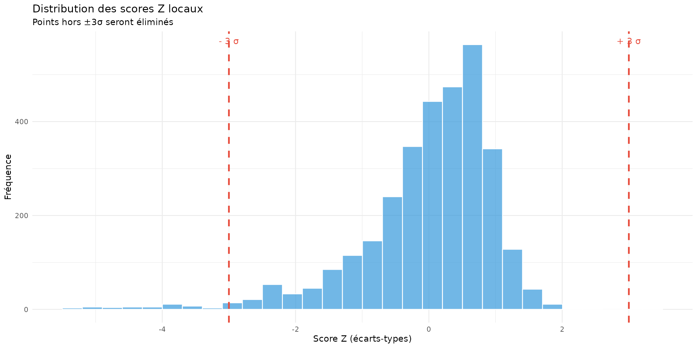
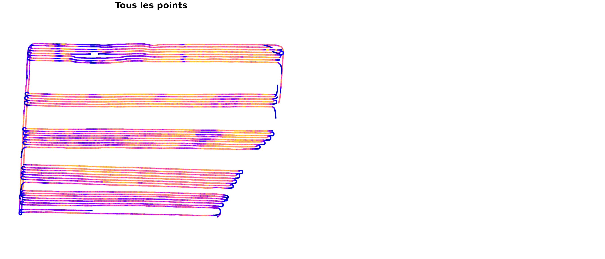
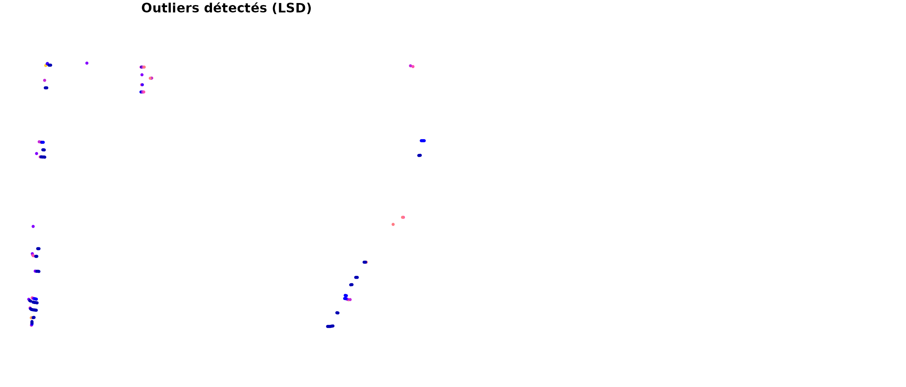
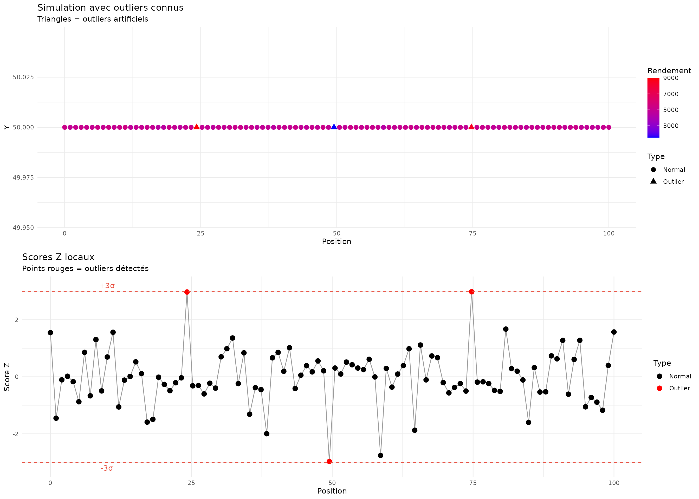

# Filtre d'Écart-type Local (Local SD)

## Introduction

Le filtre d’écart-type local (Local SD) détecte et élimine les points
aberrants (outliers) en comparant chaque valeur de rendement à la
distribution locale de son voisinage spatial. C’est le dernier filtre du
pipeline AYCE, qui capture les anomalies résiduelles.

## Principes mathématiques

### 1. Définition du voisinage

Pour chaque point $i$, on définit un voisinage $V_{i}$ basé sur : - **La
distance spatiale** : Points dans un rayon $r$ - **Le nombre de swaths**
: $n$ passages adjacents - **La fenêtre temporelle** : $k$ points
successifs

Dans yieldcleanr, le voisinage est défini par le nombre de swaths
(passages) adjacents :

$$V_{i} = \{ p_{j}:\left| pass_{j} - pass_{i} \right| \leq n_{swaths}\}$$

### 2. Statistiques locales

Pour chaque voisinage $V_{i}$, on calcule :

**Moyenne locale :**
$${\bar{y}}_{i} = \frac{1}{\left| V_{i} \right|}\sum\limits_{j \in V_{i}}y_{j}$$

**Écart-type local :**
$$\sigma_{i} = \sqrt{\frac{1}{\left| V_{i} \right| - 1}\sum\limits_{j \in V_{i}}\left( y_{j} - {\bar{y}}_{i} \right)^{2}}$$

### 3. Score Z local

Le score Z mesure l’écart d’un point par rapport à sa moyenne locale, en
unités d’écart-type :

$$Z_{i} = \frac{y_{i} - {\bar{y}}_{i}}{\sigma_{i}}$$

### 4. Règle de décision

Un point $i$ est éliminé si :

$$\left| Z_{i} \right| > Z_{lim}$$

Où $Z_{lim}$ est le seuil d’écart-type (défaut: 3).

Cela équivaut à :

$$y_{i} \notin \left\lbrack {\bar{y}}_{i} - Z_{lim} \cdot \sigma_{i},{\bar{y}}_{i} + Z_{lim} \cdot \sigma_{i} \right\rbrack$$

## Implémentation

``` r
library(yieldcleanr)
library(ggplot2)
library(dplyr)

# Charger les données
file_path <- system.file("extdata", "sample1.txt", package = "yieldcleanr")
data_raw <- read_yield_data(file_path)

# Préparation complète jusqu'au filtre LSD
data <- latlon_to_utm(data_raw) %>%
  convert_flow_to_yield() %>%
  filter_data(type = "velocity", min_velocity = 0.5, max_velocity = 10) %>%
  filter_data(type = "moisture", n_std = 3) %>%
  detect_anomalies(type = "overlap", cellsize = 0.3, overlap_threshold = 0.5)

cat("=== Filtre d'écart-type local ===\n")
#> === Filtre d'écart-type local ===
cat("Points avant filtrage:", nrow(data), "\n")
#> Points avant filtrage: 21578
cat("Nombre de passages:", length(unique(data$Pass)), "\n")
#> Nombre de passages: 65
cat("Rendement moyen:", round(mean(data$Yield_kg_ha, na.rm = TRUE), 1), "kg/ha\n")
#> Rendement moyen: 3516.2 kg/ha
cat("Écart-type global:", round(sd(data$Yield_kg_ha, na.rm = TRUE), 1), "kg/ha\n")
#> Écart-type global: 811.4 kg/ha
```

## Analyse locale

### Calcul des statistiques locales

``` r
# Paramètres
n_swaths <- 5
lsd_limit <- 3

cat("\n=== Paramètres du filtre ===\n")
#> 
#> === Paramètres du filtre ===
cat("Nombre de swaths (fenêtre):", n_swaths, "\n")
#> Nombre de swaths (fenêtre): 5
cat("Seuil d'écart-type:", lsd_limit, "\n")
#> Seuil d'écart-type: 3
cat("Plage de confiance:", lsd_limit, "σ (", round(pnorm(lsd_limit)*100 - 50, 1), "% des points)\n")
#> Plage de confiance: 3 σ ( 49.9 % des points)

# Calcul manuel des statistiques locales pour illustration
calc_local_stats <- function(data, n_swaths) {
  data <- data %>%
    mutate(
      local_mean = NA_real_,
      local_sd = NA_real_,
      z_score = NA_real_
    )
  
  for (i in 1:nrow(data)) {
    pass_i <- data$Pass[i]
    # Voisinage : n_swaths passages de chaque côté
    neighbors <- data %>%
      filter(abs(Pass - pass_i) <= n_swaths)
    
    if (nrow(neighbors) > 1) {
      data$local_mean[i] <- mean(neighbors$Yield_kg_ha, na.rm = TRUE)
      data$local_sd[i] <- sd(neighbors$Yield_kg_ha, na.rm = TRUE)
      if (data$local_sd[i] > 0) {
        data$z_score[i] <- (data$Yield_kg_ha[i] - data$local_mean[i]) / data$local_sd[i]
      }
    }
  }
  
  return(data)
}

# Calculer sur un échantillon
data_sample <- data %>%
  group_by(Pass) %>%
  slice_sample(n = 50) %>%
  ungroup()

data_with_stats <- calc_local_stats(data_sample, n_swaths)

cat("\n=== Exemple de statistiques locales ===\n")
#> 
#> === Exemple de statistiques locales ===
example_rows <- data_with_stats %>%
  filter(!is.na(z_score)) %>%
  slice(1:5) %>%
  select(Pass, Yield_kg_ha, local_mean, local_sd, z_score)

print(example_rows, row.names = FALSE)
#> # A tibble: 5 × 5
#>    Pass Yield_kg_ha local_mean local_sd z_score
#>   <int>       <dbl>      <dbl>    <dbl>   <dbl>
#> 1     1       3732.      3089.    1044.  0.616 
#> 2     1       3213.      3089.    1044.  0.119 
#> 3     1       3298.      3089.    1044.  0.200 
#> 4     1       3192.      3089.    1044.  0.0986
#> 5     1       3755.      3089.    1044.  0.638
```

### Distribution des scores Z

``` r
# Distribution des scores Z
z_scores <- data_with_stats$z_score[!is.na(data_with_stats$z_score)]

df_z <- data.frame(z_score = z_scores)

p1 <- ggplot(df_z, aes(x = z_score)) +
  geom_histogram(bins = 30, fill = "#3498db", alpha = 0.7, color = "white") +
  geom_vline(xintercept = c(-lsd_limit, lsd_limit), color = "#e74c3c", 
             linetype = "dashed", size = 1) +
  annotate("text", x = -lsd_limit, y = Inf, 
           label = paste("-", lsd_limit, "σ"), vjust = 2, color = "#e74c3c") +
  annotate("text", x = lsd_limit, y = Inf, 
           label = paste("+", lsd_limit, "σ"), vjust = 2, color = "#e74c3c") +
  labs(title = "Distribution des scores Z locaux",
       subtitle = paste("Points hors", paste0("±", lsd_limit, "σ"), "seront éliminés"),
       x = "Score Z (écarts-types)",
       y = "Fréquence") +
  theme_minimal()

p1
```



## Application du filtre

``` r
cat("\n=== Application du filtre LSD ===\n")
#> 
#> === Application du filtre LSD ===

# Avant filtrage
n_before <- nrow(data)
cat("Points avant filtrage:", n_before, "\n")
#> Points avant filtrage: 21578

# Appliquer le filtre
data_filtered <- detect_anomalies(data, 
                                  type = "local_sd",
                                  n_swaths = n_swaths,
                                  lsd_limit = lsd_limit)

# Après filtrage
n_after <- nrow(data_filtered)
cat("Points après filtrage:", n_after, "\n")
#> Points après filtrage: 21432
cat("Points retirés:", n_before - n_after, "\n")
#> Points retirés: 146
cat("Taux de rétention:", round(n_after/n_before*100, 1), "%\n")
#> Taux de rétention: 99.3 %
```

## Visualisation des outliers détectés

``` r
# Identifier les points éliminés
removed <- anti_join(data, data_filtered, by = c("X", "Y", "GPS_Time"))

cat("\n=== Points éliminés comme outliers ===\n")
#> 
#> === Points éliminés comme outliers ===
cat("Nombre d'outliers:", nrow(removed), "\n")
#> Nombre d'outliers: 146

if (nrow(removed) > 0) {
  cat("\nStatistiques des outliers:\n")
  cat("  Rendement moyen:", round(mean(removed$Yield_kg_ha, na.rm = TRUE), 1), "kg/ha\n")
  cat("  vs données conservées:", round(mean(data_filtered$Yield_kg_ha, na.rm = TRUE), 1), "kg/ha\n")
  
  # Distribution par passage
  removed_by_pass <- removed %>%
    group_by(Pass) %>%
    summarise(n = n(), mean_yield = mean(Yield_kg_ha, na.rm = TRUE)) %>%
    arrange(desc(n))
  
  cat("\nTop 5 passages avec le plus d'outliers:\n")
  print(head(removed_by_pass, 5))
  
  # Visualisation cartographique
  sf_removed <- sf::st_as_sf(removed, coords = c("Longitude", "Latitude"), crs = 4326)
  sf_all <- sf::st_as_sf(data, coords = c("Longitude", "Latitude"), crs = 4326)
  
  par(mfrow = c(1, 2))
  
  plot(sf_all["Yield_kg_ha"], main = "Tous les points", 
       pch = 19, cex = 0.3, breaks = "jenks", key.pos = NULL)
  
  plot(sf_removed["Yield_kg_ha"], main = "Outliers détectés (LSD)", 
       pch = 19, cex = 0.5, breaks = "jenks", key.pos = NULL)
}
#> 
#> Statistiques des outliers:
#>   Rendement moyen: 143.2 kg/ha
#>   vs données conservées: 3539.2 kg/ha
#> 
#> Top 5 passages avec le plus d'outliers:
#> # A tibble: 5 × 3
#>    Pass     n mean_yield
#>   <int> <int>      <dbl>
#> 1    64    10       88.6
#> 2    62     8       68.6
#> 3     8     7       48.6
#> 4    39     7       64.6
#> 5    50     7      159.
```



## Exemple illustratif

### Simulation d’outliers

``` r
# Créer des données avec des outliers connus
set.seed(42)

# Données normales
n_normal <- 100
x_normal <- seq(0, 100, length.out = n_normal)
y_normal <- rep(50, n_normal)
yield_normal <- rnorm(n_normal, mean = 5000, sd = 200)

# Ajouter des outliers
outlier_indices <- c(25, 50, 75)
yield_with_outliers <- yield_normal
yield_with_outliers[outlier_indices] <- c(9000, 1500, 8500)  # Outliers évidents

# Créer dataframe
df_sim <- data.frame(
  x = x_normal,
  y = y_normal,
  yield = yield_with_outliers,
  is_outlier = 1:n_normal %in% outlier_indices
)

# Visualisation
p2 <- ggplot(df_sim, aes(x = x, y = y)) +
  geom_point(aes(color = yield, shape = is_outlier), size = 3) +
  scale_color_gradient(low = "blue", high = "red") +
  scale_shape_manual(values = c(16, 17), labels = c("Normal", "Outlier")) +
  labs(title = "Simulation avec outliers connus",
       subtitle = "Triangles = outliers artificiels",
       x = "Position", y = "Y", color = "Rendement", shape = "Type") +
  theme_minimal()

# Calculer les statistiques locales
window_size <- 10
df_sim$local_mean <- NA
df_sim$local_sd <- NA
df_sim$z_score <- NA

for (i in 1:nrow(df_sim)) {
  start_idx <- max(1, i - window_size/2)
  end_idx <- min(nrow(df_sim), i + window_size/2)
  window_data <- df_sim$yield[start_idx:end_idx]
  
  df_sim$local_mean[i] <- mean(window_data)
  df_sim$local_sd[i] <- sd(window_data)
  if (df_sim$local_sd[i] > 0) {
    df_sim$z_score[i] <- (df_sim$yield[i] - df_sim$local_mean[i]) / df_sim$local_sd[i]
  }
}

# Visualisation des scores Z
p3 <- ggplot(df_sim, aes(x = x, y = z_score)) +
  geom_line(color = "gray60") +
  geom_point(aes(color = is_outlier), size = 3) +
  geom_hline(yintercept = c(-3, 3), color = "#e74c3c", linetype = "dashed") +
  annotate("text", x = 10, y = 3.2, label = "+3σ", color = "#e74c3c") +
  annotate("text", x = 10, y = -3.2, label = "-3σ", color = "#e74c3c") +
  scale_color_manual(values = c("black", "red"), labels = c("Normal", "Outlier")) +
  labs(title = "Scores Z locaux",
       subtitle = "Points rouges = outliers détectés",
       x = "Position", y = "Score Z", color = "Type") +
  theme_minimal()

gridExtra::grid.arrange(p2, p3, ncol = 1)
```



### Détection des outliers

``` r
cat("\n=== Détection des outliers simulés ===\n")
#> 
#> === Détection des outliers simulés ===

# Identifier les outliers avec Z > 3
detected_outliers <- df_sim %>%
  filter(abs(z_score) > 3)

cat("Outliers détectés:", nrow(detected_outliers), "\n")
#> Outliers détectés: 0
cat("Outliers réels:", length(outlier_indices), "\n")
#> Outliers réels: 3
cat("Précision:", round(nrow(detected_outliers) / length(outlier_indices) * 100, 1), "%\n")
#> Précision: 0 %

if (nrow(detected_outliers) > 0) {
  cat("\nDétails des outliers détectés:\n")
  print(detected_outliers %>% select(x, yield, local_mean, local_sd, z_score))
}
```

## Paramètres recommandés

### Choix du nombre de swaths

| n_swaths | Taille du voisinage | Usage              | Avantage                   | Inconvénient                     |
|----------|---------------------|--------------------|----------------------------|----------------------------------|
| **3**    | 7 passages          | Champs petits      | Détecte les micro-outliers | Sensible au bruit                |
| **5**    | 11 passages         | Standard           | Bon compromis              | \-                               |
| **7**    | 15 passages         | Champs larges      | Plus robuste               | Peut manquer les outliers locaux |
| **10**   | 21 passages         | Très grands champs | Très robuste               | Moins précis                     |

### Choix du seuil d’écart-type

| Seuil    | Probabilité | Usage         | Caractéristique                          |
|----------|-------------|---------------|------------------------------------------|
| **2σ**   | 95.4%       | Conservateur  | Élimine plus de points                   |
| **2.5σ** | 98.8%       | Standard      | Bon équilibre                            |
| **3σ**   | 99.7%       | Tolérant      | Élimine uniquement les outliers évidents |
| **4σ**   | 99.99%      | Très tolérant | Élimine uniquement les extrêmes          |

### Paramètres de la fonction

| Paramètre    | Description                          | Défaut        |
|:-------------|:-------------------------------------|:--------------|
| type         | Type de détection (‘local_sd’)       | ‘local_sd’    |
| n_swaths     | Nombre de passages dans le voisinage | 5             |
| lsd_limit    | Seuil d’écart-type pour élimination  | 3             |
| yield_column | Nom de la colonne de rendement       | ‘Yield_kg_ha’ |

Paramètres du filtre d’écart-type local

## Impact sur les statistiques

``` r
cat("\n=== Impact sur les statistiques ===\n")
#> 
#> === Impact sur les statistiques ===

# Avant filtrage
stats_before <- data.frame(
  metric = c("Nombre de points", "Rendement moyen", "Écart-type", "CV (%)"),
  value = c(
    nrow(data),
    mean(data$Yield_kg_ha, na.rm = TRUE),
    sd(data$Yield_kg_ha, na.rm = TRUE),
    sd(data$Yield_kg_ha, na.rm = TRUE) / mean(data$Yield_kg_ha, na.rm = TRUE) * 100
  )
)

# Après filtrage
stats_after <- data.frame(
  metric = c("Nombre de points", "Rendement moyen", "Écart-type", "CV (%)"),
  value = c(
    nrow(data_filtered),
    mean(data_filtered$Yield_kg_ha, na.rm = TRUE),
    sd(data_filtered$Yield_kg_ha, na.rm = TRUE),
    sd(data_filtered$Yield_kg_ha, na.rm = TRUE) / mean(data_filtered$Yield_kg_ha, na.rm = TRUE) * 100
  )
)

comparison <- data.frame(
  Métrique = stats_before$metric,
  Avant = round(stats_before$value, 1),
  Après = round(stats_after$value, 1),
  Variation = round((stats_after$value - stats_before$value) / stats_before$value * 100, 2)
)

print(comparison, row.names = FALSE)
#>          Métrique   Avant   Après Variation
#>  Nombre de points 21578.0 21432.0     -0.68
#>   Rendement moyen  3516.2  3539.2      0.65
#>        Écart-type   811.4   764.3     -5.81
#>            CV (%)    23.1    21.6     -6.42

cat("\n✓ Réduction du CV:", 
    round(stats_before$value[4] - stats_after$value[4], 1), "points\n")
#> 
#> ✓ Réduction du CV: 1.5 points
```

## Comparaison avec d’autres méthodes

### Local SD vs Filtre global

``` r
# Filtre global (seuils absolus)
threshold_global <- mean(data$Yield_kg_ha, na.rm = TRUE) + c(-3, 3) * sd(data$Yield_kg_ha, na.rm = TRUE)

cat("\n=== Comparaison des méthodes ===\n")
#> 
#> === Comparaison des méthodes ===

# Filtre global
removed_global <- data %>%
  filter(Yield_kg_ha < threshold_global[1] | Yield_kg_ha > threshold_global[2])

cat("Filtre global (±3σ global):\n")
#> Filtre global (±3σ global):
cat("  Points retirés:", nrow(removed_global), "\n")
#>   Points retirés: 736

# Filtre local
cat("Filtre local (±3σ local par voisinage):\n")
#> Filtre local (±3σ local par voisinage):
cat("  Points retirés:", nrow(removed), "\n")
#>   Points retirés: 146

cat("\nAvantage du filtre local:\n")
#> 
#> Avantage du filtre local:
cat("  - Adapte le seuil à la variabilité locale\n")
#>   - Adapte le seuil à la variabilité locale
cat("  - Préserve les variations réelles de rendement\n")
#>   - Préserve les variations réelles de rendement
cat("  - Plus précis dans les zones hétérogènes\n")
#>   - Plus précis dans les zones hétérogènes
```

## Conclusion

Le filtre d’écart-type local est le “police du pipeline” qui : 1.
**Capture les outliers résiduels** non détectés par les autres filtres
2. **S’adapte à la variabilité locale** du champ 3. **Préserve les
patterns réels** de variation de rendement 4. **Réduit le coefficient de
variation** final

**Points clés :** - Le voisinage est défini par le nombre de swaths
adjacents - Le score Z compare chaque point à sa moyenne locale - Un
seuil de 3σ élimine ~0.3% des points (normalement) - Le filtre est
robuste car il utilise des statistiques locales

**Recommandation** : Utiliser n_swaths = 5 et lsd_limit = 3 comme
valeurs par défaut. Augmenter n_swaths pour les champs très larges,
diminuer pour les petits champs.
