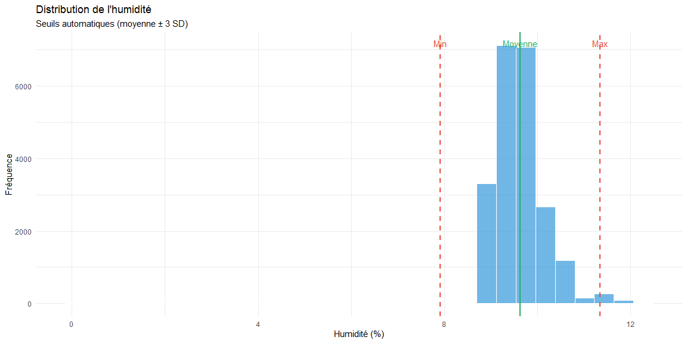
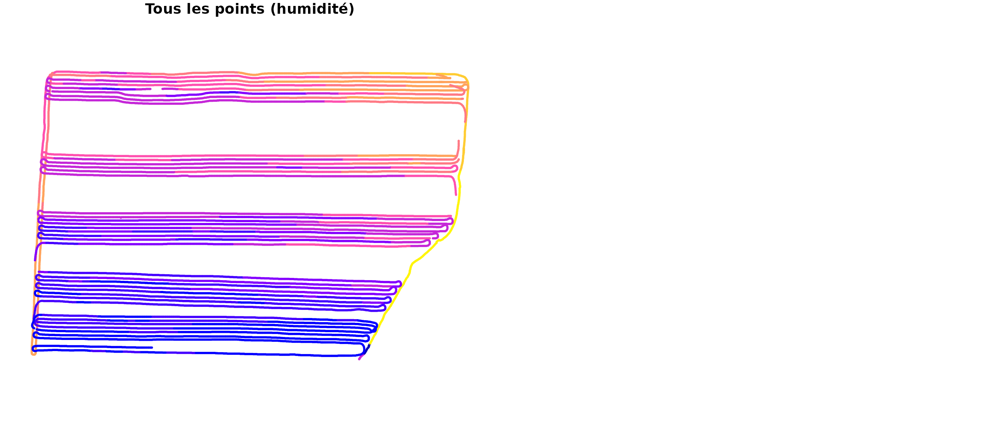
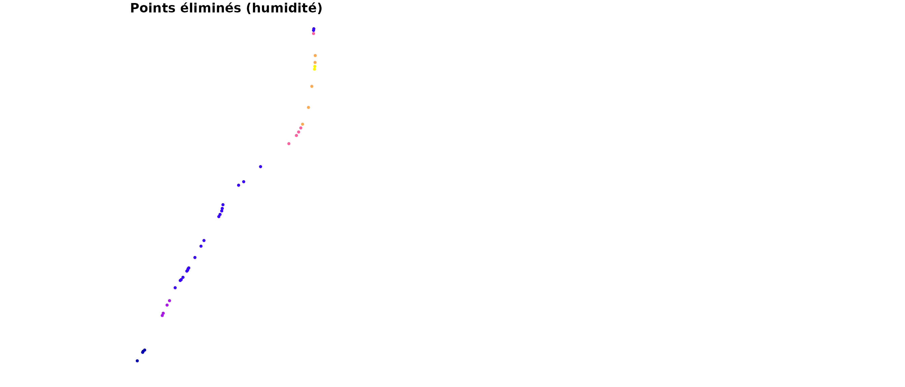
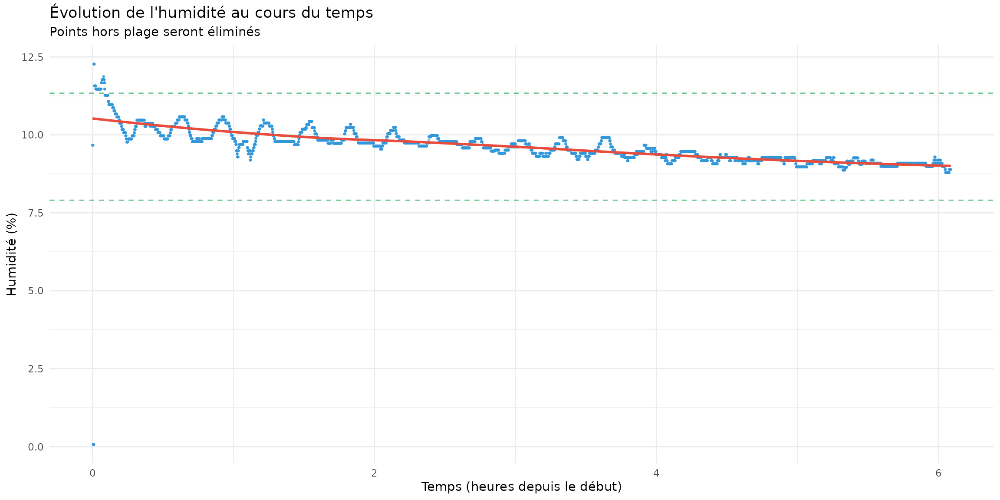
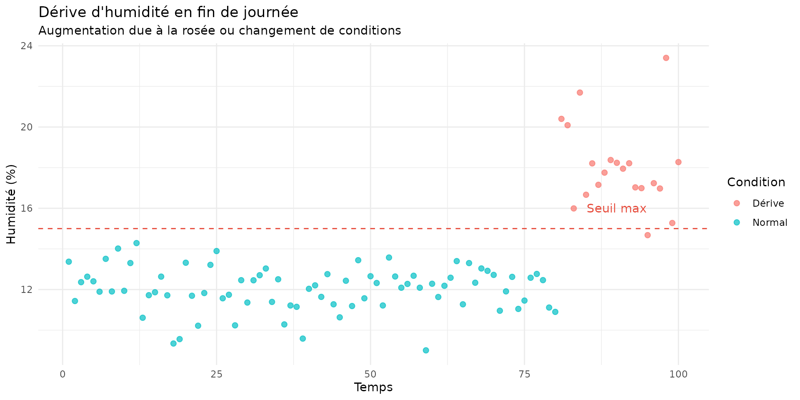

# Filtre d'Humidité

## Introduction

Le filtre d’humidité élimine les points avec des taux d’humidité
anormaux. L’humidité du grain est un paramètre critique qui : - Affecte
la conversion du rendement humide vers le rendement sec - Varie avec les
conditions météorologiques - Peut dériver en fin de journée ou lors des
changements de variété

## Principes mathématiques

### Conversion rendement humide → sec

Le rendement sec est calculé à partir du rendement humide et de
l’humidité :

$$Y_{sec} = Y_{humide} \times \frac{100 - H}{100 - H_{std}}$$

Où : - $Y_{sec}$ = rendement à humidité standard (kg/ha) - $Y_{humide}$
= rendement tel que mesuré (kg/ha) - $H$ = humidité mesurée (%) -
$H_{std}$ = humidité standard de la culture (%)

#### Humidités standards par culture

| Culture | Humidité standard | Base      |
|---------|-------------------|-----------|
| Maïs    | 15.5%             | 56 lbs/bu |
| Soja    | 13.0%             | 60 lbs/bu |
| Blé     | 13.5%             | 60 lbs/bu |

### Définition de la plage acceptable

#### Méthode 1: Seuils fixes

Basée sur les limites physiologiques et commerciales :

| Culture | Minimum | Maximum | Remarques                                 |
|---------|---------|---------|-------------------------------------------|
| Maïs    | 10%     | 40%     | Au-dessus de 40% = grain vert             |
| Soja    | 8%      | 20%     | Au-dessus de 20% = fermentation           |
| Blé     | 10%     | 25%     | Au-dessus de 25% = difficultés de battage |

#### Méthode 2: Calcul automatique (méthode AYCE)

Basée sur la distribution statistique de l’humidité dans le champ :

$$H_{min} = \bar{H} - n_{std} \times \sigma_{H}$$$$H_{max} = \bar{H} + n_{std} \times \sigma_{H}$$

Où : - $\bar{H}$ = humidité moyenne - $\sigma_{H}$ = écart-type de
l’humidité - $n_{std}$ = nombre d’écarts-types (défaut: 3)

### Règle de décision

Un point $i$ est conservé si :

$$H_{min} \leq H_{i} \leq H_{max}$$

Et si $H_{i} > 0$ (humidité valide).

## Implémentation

``` r
library(yieldcleanr)
library(ggplot2)
library(dplyr)

# Charger les données
file_path <- system.file("extdata", "sample1.txt", package = "yieldcleanr")
data_raw <- read_yield_data(file_path)

# Réduire la taille pour accélérer le build (échantillon représentatif)
set.seed(42)
if (nrow(data_raw) > 3000) {
  data_raw <- data_raw[sample(nrow(data_raw), 3000), ]
}

# Préparation
data <- latlon_to_utm(data_raw) %>%
  convert_flow_to_yield()

cat("=== Filtre d'humidité ===\n")
#> === Filtre d'humidité ===
cat("Points avant filtrage:", nrow(data), "\n")
#> Points avant filtrage: 2998
cat("Humidité (%):\n")
#> Humidité (%):
cat("  Moyenne:", round(mean(data$Moisture, na.rm = TRUE), 1), "\n")
#>   Moyenne: 9.6
cat("  Min:", round(min(data$Moisture, na.rm = TRUE), 1), "\n")
#>   Min: 0.1
cat("  Max:", round(max(data$Moisture, na.rm = TRUE), 1), "\n")
#>   Max: 11.9
cat("  Écart-type:", round(sd(data$Moisture, na.rm = TRUE), 1), "\n")
#>   Écart-type: 0.6
```

## Calcul automatique des seuils

### Méthode statistique

``` r
# Calculer les seuils automatiques
n_std <- 3
mean_moisture <- mean(data$Moisture, na.rm = TRUE)
sd_moisture <- sd(data$Moisture, na.rm = TRUE)

min_moisture_auto <- mean_moisture - n_std * sd_moisture
max_moisture_auto <- mean_moisture + n_std * sd_moisture

cat("\n=== Seuils calculés automatiquement ===\n")
#> 
#> === Seuils calculés automatiquement ===
cat("Moyenne:", round(mean_moisture, 1), "%\n")
#> Moyenne: 9.6 %
cat("Écart-type:", round(sd_moisture, 1), "%\n")
#> Écart-type: 0.6 %
cat("Plage (moyenne ± 3 SD):\n")
#> Plage (moyenne ± 3 SD):
cat("  Minimum:", round(min_moisture_auto, 1), "%\n")
#>   Minimum: 7.8 %
cat("  Maximum:", round(max_moisture_auto, 1), "%\n")
#>   Maximum: 11.4 %
```

### Distribution de l’humidité

``` r
# Distribution de l'humidité
moistures <- data$Moisture[is.finite(data$Moisture)]

p1 <- ggplot(data.frame(moisture = moistures), aes(x = moisture)) +
  geom_histogram(bins = 30, fill = "#3498db", alpha = 0.7, color = "white") +
  geom_vline(xintercept = min_moisture_auto, color = "#e74c3c", 
             linetype = "dashed", size = 1) +
  geom_vline(xintercept = max_moisture_auto, color = "#e74c3c", 
             linetype = "dashed", size = 1) +
  geom_vline(xintercept = mean_moisture, color = "#27ae60", 
             linetype = "solid", size = 1) +
  annotate("text", x = min_moisture_auto, y = Inf, 
           label = "Min", vjust = 2, color = "#e74c3c") +
  annotate("text", x = max_moisture_auto, y = Inf, 
           label = "Max", vjust = 2, color = "#e74c3c") +
  annotate("text", x = mean_moisture, y = Inf, 
           label = "Moyenne", vjust = 2, color = "#27ae60") +
  labs(title = "Distribution de l'humidité",
       subtitle = "Seuils automatiques (moyenne ± 3 SD)",
       x = "Humidité (%)",
       y = "Fréquence") +
  theme_minimal()

p1
```



## Application du filtre

### Filtrage automatique

``` r
cat("\n=== Application du filtre automatique ===\n")
#> 
#> === Application du filtre automatique ===

# Appliquer le filtre
data_filtered <- filter_data(data, type = "moisture", n_std = 3)

cat("Points après filtrage:", nrow(data_filtered), "\n")
#> Points après filtrage: 2957
cat("Points retirés:", nrow(data) - nrow(data_filtered), "\n")
#> Points retirés: 41
cat("Taux de rétention:", round(nrow(data_filtered)/nrow(data)*100, 1), "%\n")
#> Taux de rétention: 98.6 %
```

### Filtrage manuel

``` r
cat("\n=== Filtrage avec seuils manuels ===\n")
#> 
#> === Filtrage avec seuils manuels ===

# Seuils pour soja
min_manual <- 8
max_manual <- 20

cat("Seuils manuels (soja):", min_manual, "-", max_manual, "%\n")
#> Seuils manuels (soja): 8 - 20 %

data_manual <- filter_data(data, 
                           type = "moisture",
                           min_moisture = min_manual,
                           max_moisture = max_manual)

cat("Points après filtrage manuel:", nrow(data_manual), "\n")
#> Points après filtrage manuel: 2994
cat("Points retirés:", nrow(data) - nrow(data_manual), "\n")
#> Points retirés: 4
```

## Visualisation des points éliminés

``` r
# Identifier les points éliminés
removed <- data %>%
  filter(Moisture < min_moisture_auto | 
         Moisture > max_moisture_auto |
         !is.finite(Moisture))

cat("\nPoints éliminés par humidité:", nrow(removed), "\n")
#> 
#> Points éliminés par humidité: 41

if (nrow(removed) > 0) {
  sf_removed <- sf::st_as_sf(removed, coords = c("Longitude", "Latitude"), crs = 4326)
  sf_all <- sf::st_as_sf(data, coords = c("Longitude", "Latitude"), crs = 4326)
  
  par(mfrow = c(1, 2))
  
  plot(sf_all["Moisture"], main = "Tous les points (humidité)", 
       pch = 19, cex = 0.3, breaks = "jenks", key.pos = NULL)
  
  plot(sf_removed["Moisture"], main = "Points éliminés (humidité)", 
       pch = 19, cex = 0.5, breaks = "jenks", key.pos = NULL)
}
```



## Analyse temporelle de l’humidité

### Variation au cours de la récolte

``` r
# Trier par temps et échantillonner pour la ligne de tendance (LOESS est lent avec beaucoup de points)
data_time <- data %>%
  arrange(GPS_Time) %>%
  mutate(time_normalized = (GPS_Time - min(GPS_Time)) / 3600)  # En heures

# Échantillon pour la ligne de tendance (max 5000 points)
n_points <- nrow(data_time)
if (n_points > 5000) {
  set.seed(42)
  data_sample <- data_time[sample(n_points, 5000), ]
} else {
  data_sample <- data_time
}

# Graphique temporel
p2 <- ggplot(data_time, aes(x = time_normalized, y = Moisture)) +
  geom_point(alpha = 0.3, size = 0.5, color = "#3498db") +
  geom_smooth(data = data_sample, method = "loess", color = "#e74c3c", se = TRUE, span = 0.5) +
  geom_hline(yintercept = min_moisture_auto, color = "#27ae60", 
             linetype = "dashed", alpha = 0.7) +
  geom_hline(yintercept = max_moisture_auto, color = "#27ae60", 
             linetype = "dashed", alpha = 0.7) +
  labs(title = "Évolution de l'humidité au cours du temps",
       subtitle = "Points hors plage seront éliminés",
       x = "Temps (heures depuis le début)",
       y = "Humidité (%)") +
  theme_minimal()

p2
```



## Impact sur le rendement

### Conversion humide → sec

``` r
cat("\n=== Impact de l'humidité sur le rendement ===\n")
#> 
#> === Impact de l'humidité sur le rendement ===

# Calculer le rendement sec
humidite_standard <- 13  # Pour soja

# Avant filtrage
rendement_humide <- mean(data$Yield_kg_ha, na.rm = TRUE)
humidite_moyenne <- mean(data$Moisture, na.rm = TRUE)
rendement_sec_brut <- rendement_humide * (100 - humidite_moyenne) / (100 - humidite_standard)

cat("Avant filtrage:\n")
#> Avant filtrage:
cat("  Rendement humide moyen:", round(rendement_humide, 1), "kg/ha\n")
#>   Rendement humide moyen: 3523.5 kg/ha
cat("  Humidité moyenne:", round(humidite_moyenne, 1), "%\n")
#>   Humidité moyenne: 9.6 %
cat("  Rendement sec équivalent:", round(rendement_sec_brut, 1), "kg/ha\n")
#>   Rendement sec équivalent: 3660.6 kg/ha

# Après filtrage
rendement_humide_filt <- mean(data_filtered$Yield_kg_ha, na.rm = TRUE)
humidite_moyenne_filt <- mean(data_filtered$Moisture, na.rm = TRUE)
rendement_sec_filt <- rendement_humide_filt * (100 - humidite_moyenne_filt) / (100 - humidite_standard)

cat("\nAprès filtrage:\n")
#> 
#> Après filtrage:
cat("  Rendement humide moyen:", round(rendement_humide_filt, 1), "kg/ha\n")
#>   Rendement humide moyen: 3524.3 kg/ha
cat("  Humidité moyenne:", round(humidite_moyenne_filt, 1), "%\n")
#>   Humidité moyenne: 9.6 %
cat("  Rendement sec équivalent:", round(rendement_sec_filt, 1), "kg/ha\n")
#>   Rendement sec équivalent: 3661.9 kg/ha

cat("\nDifférence:", round(rendement_sec_filt - rendement_sec_brut, 1), "kg/ha\n")
#> 
#> Différence: 1.3 kg/ha
```

## Paramètres recommandés

### Par culture

| Culture | Humidité standard | Plage acceptable | n_std recommandé |
|---------|-------------------|------------------|------------------|
| Maïs    | 15.5%             | 10-40%           | 3                |
| Soja    | 13.0%             | 8-20%            | 3                |
| Blé     | 13.5%             | 10-25%           | 3                |
| Orge    | 14.5%             | 10-25%           | 3                |

### Paramètres de la fonction

| Paramètre       | Description                            | Défaut     |
|:----------------|:---------------------------------------|:-----------|
| type            | Type de filtre (‘moisture’)            | ‘moisture’ |
| min_value       | Humidité minimum (%)                   | auto       |
| max_value       | Humidité maximum (%)                   | auto       |
| n_std           | Nombre d’écarts-types pour calcul auto | 3          |
| moisture_column | Nom de la colonne d’humidité           | ‘Moisture’ |

Paramètres du filtre d’humidité

## Cas particuliers

### 1. Humidité nulle ou manquante

``` r
# Points avec humidité nulle ou manquante
zero_moist <- data %>%
  filter(Moisture <= 0 | is.na(Moisture))

cat("Points avec humidité ≤ 0 ou manquante:", nrow(zero_moist), "\n")
#> Points avec humidité ≤ 0 ou manquante: 0
cat("Ces points sont généralement éliminés car l'humidité est requise\n")
#> Ces points sont généralement éliminés car l'humidité est requise
cat("pour la conversion rendement humide → sec.\n")
#> pour la conversion rendement humide → sec.
```

### 2. Dérive d’humidité en fin de journée

``` r
# Simuler une dérive d'humidité
set.seed(42)
temps <- 1:100
humidite_normale <- rnorm(100, mean = 12, sd = 1)
humidite_derfive <- c(humidite_normale[1:80], rnorm(20, mean = 18, sd = 2))

df_drift <- data.frame(
  temps = temps,
  humidite = humidite_derfive,
  type = c(rep("Normal", 80), rep("Dérive", 20))
)

p3 <- ggplot(df_drift, aes(x = temps, y = humidite, color = type)) +
  geom_point(size = 2, alpha = 0.7) +
  geom_hline(yintercept = 15, color = "#e74c3c", linetype = "dashed") +
  annotate("text", x = 90, y = 16, label = "Seuil max", color = "#e74c3c") +
  labs(title = "Dérive d'humidité en fin de journée",
       subtitle = "Augmentation due à la rosée ou changement de conditions",
       x = "Temps", y = "Humidité (%)", color = "Condition") +
  theme_minimal()

p3
```



## Conclusion

Le filtre d’humidité est essentiel pour : 1. **Assurer la qualité de la
conversion** humide → sec 2. **Éliminer les points avec capteur
d’humidité défectueux** 3. **Corriger les dérives temporelles** de
l’humidité 4. **Standardiser les rendements** à une humidité de
référence

**Points clés :** - L’humidité affecte directement le calcul du
rendement sec - Les seuils peuvent être calculés automatiquement (±3 SD)
ou définis manuellement - Une humidité anormale indique souvent un
problème de capteur - La dérive temporelle est courante en fin de
journée

**Recommandation** : Toujours vérifier la distribution de l’humidité
avant filtrage. Une humidité moyenne trop élevée (\> 25% pour le maïs)
peut indiquer des conditions de récolte défavorables.
