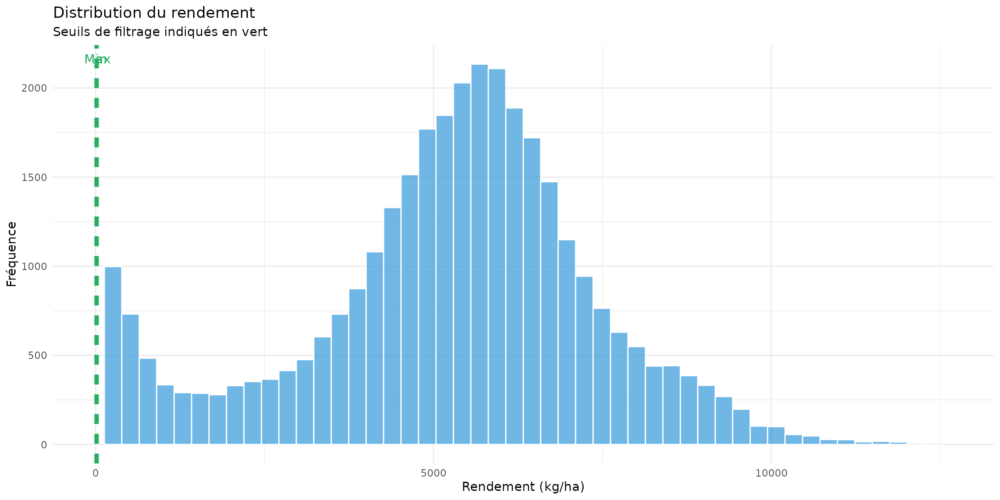
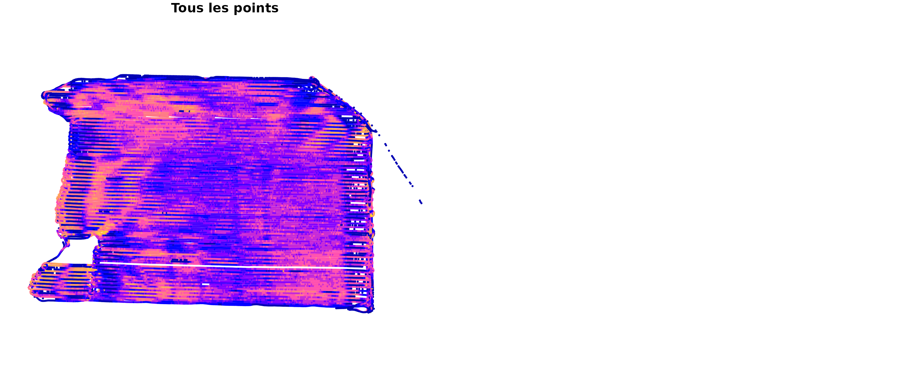
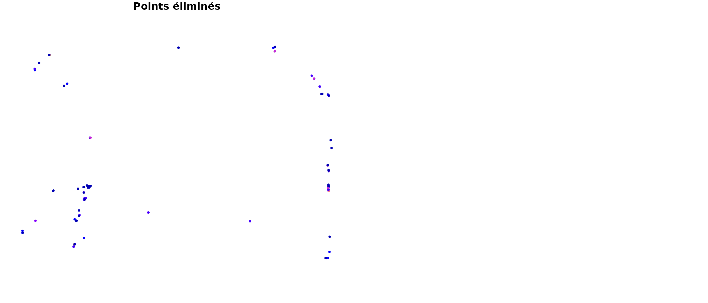
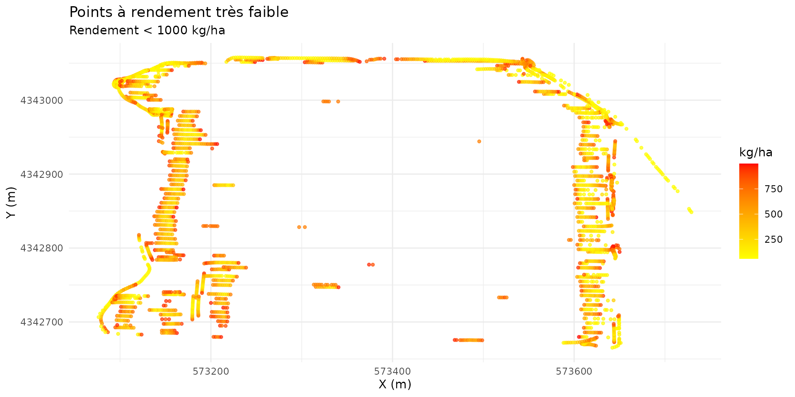
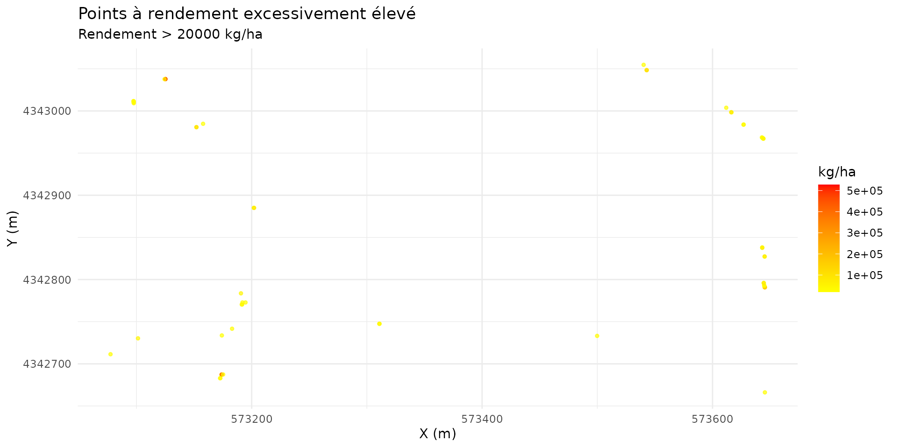

# Filtre de Plage de Rendement

## Introduction

Le filtre de plage de rendement élimine les points avec des valeurs de
rendement physiquement impossibles ou statistiquement aberrantes. Ces
anomalies peuvent être causées par : - Des erreurs de calibration du
capteur de flux - Des obstructions temporaires de la vis sans fin - Des
problèmes de synchronisation - Des valeurs manquantes ou nulles

## Principes mathématiques

### Définition de la plage acceptable

Soit $Y = \{ y_{1},y_{2},...,y_{n}\}$ l’ensemble des valeurs de
rendement observées.

La plage acceptable est définie par :

$$y_{min} \leq y_{i} \leq y_{max}$$

Où $y_{min}$ et $y_{max}$ peuvent être définis de deux manières :

#### 1. Valeurs fixes (manuelles)

Basées sur les limites physiologiques de la culture :

| Culture | Minimum | Maximum | Unité   |
|---------|---------|---------|---------|
| Maïs    | 50      | 350     | bu/acre |
| Soja    | 15      | 80      | bu/acre |
| Blé     | 20      | 120     | bu/acre |

#### 2. Calcul automatique (méthode AYCE)

Basée sur les quantiles de la distribution :

$$y_{min} = Q_{0.05}(Y) \times y_{scale\_ low}$$$$y_{max} = Q_{0.95}(Y) \times y_{scale\_ high}$$

Avec des minimums absolus pour éviter des seuils trop restrictifs.

### Règle de décision

Un point $i$ est conservé si et seulement si :

$$y_{i} \in \left\lbrack y_{min},y_{max} \right\rbrack$$

Et si la valeur est finie (pas d’Inf ou de NaN) :

$$- \infty < y_{i} < + \infty$$

## Implémentation

``` r
library(yieldcleanr)
library(ggplot2)
library(dplyr)

# Charger les données
file_path <- system.file("extdata", "sample2.txt", package = "yieldcleanr")
data_raw <- read_yield_data(file_path)

# Préparation
data <- latlon_to_utm(data_raw) %>%
  convert_flow_to_yield()

cat("=== Filtre de plage de rendement ===\n")
#> === Filtre de plage de rendement ===
cat("Points avant filtrage:", nrow(data), "\n")
#> Points avant filtrage: 33604
cat("Rendement (kg/ha):\n")
#> Rendement (kg/ha):
cat("  Moyenne:", round(mean(data$Yield_kg_ha, na.rm = TRUE), 1), "\n")
#>   Moyenne: 5293.6
cat("  Min:", round(min(data$Yield_kg_ha, na.rm = TRUE), 1), "\n")
#>   Min: 58
cat("  Max:", round(max(data$Yield_kg_ha, na.rm = TRUE), 1), "\n")
#>   Max: 527653.3
cat("  Écart-type:", round(sd(data$Yield_kg_ha, na.rm = TRUE), 1), "\n")
#>   Écart-type: 5087.8
```

## Calcul automatique des seuils

### Méthode des quantiles

``` r
# Calculer les seuils automatiques
thresholds <- calculate_thresholds(data, type = "yield")

cat("\n=== Seuils calculés automatiquement ===\n")
#> 
#> === Seuils calculés automatiquement ===
cat("Quantile 5%:", round(quantile(data$Yield_kg_ha, 0.05, na.rm = TRUE), 1), "kg/ha\n")
#> Quantile 5%: 457.6 kg/ha
cat("Quantile 95%:", round(quantile(data$Yield_kg_ha, 0.95, na.rm = TRUE), 1), "kg/ha\n")
#> Quantile 95%: 8710.9 kg/ha
cat("\nSeuil minimum:", round(thresholds$yield$min_yield, 1), "kg/ha\n")
#> 
#> Seuil minimum: 0 kg/ha
cat("Seuil maximum:", round(thresholds$yield$max_yield, 1), "kg/ha\n")
#> Seuil maximum: 14759 kg/ha
```

### Distribution du rendement

``` r
# Distribution du rendement
yields <- data$Yield_kg_ha[is.finite(data$Yield_kg_ha)]

# Limiter l'affichage pour éviter les valeurs extrêmes
ylim_max <- quantile(yields, 0.995)

p1 <- ggplot(data.frame(yield = yields), aes(x = yield)) +
  geom_histogram(bins = 50, fill = "#3498db", alpha = 0.7, color = "white") +
  geom_vline(xintercept = thresholds$yield$min_yield, color = "#27ae60",
             linetype = "dashed", size = 1) +
  geom_vline(xintercept = thresholds$yield$max_yield, color = "#27ae60",
             linetype = "dashed", size = 1) +
  annotate("text", x = thresholds$yield$min_yield, y = Inf,
           label = "Min", vjust = 2, color = "#27ae60") +
  annotate("text", x = thresholds$yield$max_yield, y = Inf,
           label = "Max", vjust = 2, color = "#27ae60") +
  labs(title = "Distribution du rendement",
       subtitle = "Seuils de filtrage indiqués en vert",
       x = "Rendement (kg/ha)",
       y = "Fréquence") +
  theme_minimal() +
  xlim(0, ylim_max)

p1
```



## Application du filtre

### Filtrage manuel

``` r
cat("\n=== Filtrage avec seuils manuels ===\n")
#> 
#> === Filtrage avec seuils manuels ===

# Définir des seuils raisonnables pour le maïs (en kg/ha)
min_yield_manual <- 2000  # ~32 bu/acre
max_yield_manual <- 15000  # ~238 bu/acre

cat("Seuils manuels:", min_yield_manual, "-", max_yield_manual, "kg/ha\n")
#> Seuils manuels: 2000 - 15000 kg/ha

# Appliquer le filtre
data_manual <- filter_data(data, 
                           type = "yield",
                           min_yield = min_yield_manual,
                           max_yield = max_yield_manual)

cat("Points après filtrage manuel:", nrow(data_manual), "\n")
#> Points après filtrage manuel: 29572
cat("Points retirés:", nrow(data) - nrow(data_manual), "\n")
#> Points retirés: 4032
```

### Filtrage automatique

``` r
cat("\n=== Filtrage avec seuils automatiques ===\n")
#> 
#> === Filtrage avec seuils automatiques ===

# Appliquer avec les seuils calculés
data_auto <- filter_data(data,
                         type = "yield",
                         min_yield = thresholds$yield$min_yield,
                         max_yield = thresholds$yield$max_yield)

cat("Points après filtrage auto:", nrow(data_auto), "\n")
#> Points après filtrage auto: 33488
cat("Points retirés:", nrow(data) - nrow(data_auto), "\n")
#> Points retirés: 116
```

## Visualisation des points éliminés

``` r
# Identifier les points éliminés
removed <- data %>%
  filter(Yield_kg_ha < thresholds$yield$min_yield | 
         Yield_kg_ha > thresholds$yield$max_yield |
         !is.finite(Yield_kg_ha))

cat("\nPoints éliminés:", nrow(removed), "\n")
#> 
#> Points éliminés: 116
cat("Détails:\n")
#> Détails:
cat("  Sous le minimum:", sum(removed$Yield_kg_ha < thresholds$yield$min_yield, na.rm = TRUE), "\n")
#>   Sous le minimum: 0
cat("  Au-dessus du maximum:", sum(removed$Yield_kg_ha > thresholds$yield$max_yield, na.rm = TRUE), "\n")
#>   Au-dessus du maximum: 116
cat("  Valeurs infinies/NaN:", sum(!is.finite(removed$Yield_kg_ha)), "\n")
#>   Valeurs infinies/NaN: 0

# Visualiser les points éliminés sur la carte
if (nrow(removed) > 0) {
  sf_removed <- sf::st_as_sf(removed, coords = c("Longitude", "Latitude"), crs = 4326)
  sf_all <- sf::st_as_sf(data, coords = c("Longitude", "Latitude"), crs = 4326)
  
  par(mfrow = c(1, 2))
  
  plot(sf_all["Yield_kg_ha"], main = "Tous les points", 
       pch = 19, cex = 0.3, breaks = "jenks", key.pos = NULL)
  
  plot(sf_removed["Yield_kg_ha"], main = "Points éliminés", 
       pch = 19, cex = 0.5, breaks = "jenks", key.pos = NULL)
}
```



## Analyse des valeurs aberrantes

### Types d’anomalies

#### 1. Rendement nul ou très faible

``` r
# Points avec rendement très faible
low_yield <- data %>%
  filter(Yield_kg_ha < 1000)

cat("Points avec rendement < 1000 kg/ha:", nrow(low_yield), "\n")
#> Points avec rendement < 1000 kg/ha: 2794
cat("Causes possibles:\n")
#> Causes possibles:
cat("  - Capteur de flux obstrué\n")
#>   - Capteur de flux obstrué
cat("  - Manœuvres de demi-tour\n")
#>   - Manœuvres de demi-tour
cat("  - Zones non récoltées\n")
#>   - Zones non récoltées
cat("  - Erreurs de calibration\n")
#>   - Erreurs de calibration

if (nrow(low_yield) > 0) {
  ggplot(low_yield, aes(x = X, y = Y, color = Yield_kg_ha)) +
    geom_point(size = 1, alpha = 0.7) +
    scale_color_gradient(low = "yellow", high = "red") +
    labs(title = "Points à rendement très faible",
         subtitle = "Rendement < 1000 kg/ha",
         x = "X (m)", y = "Y (m)", color = "kg/ha") +
    theme_minimal()
}
```



#### 2. Rendement excessivement élevé

``` r
# Points avec rendement très élevé
high_yield <- data %>%
  filter(Yield_kg_ha > 20000)

cat("\nPoints avec rendement > 20000 kg/ha:", nrow(high_yield), "\n")
#> 
#> Points avec rendement > 20000 kg/ha: 59
cat("Causes possibles:\n")
#> Causes possibles:
cat("  - Capteur de flux défectueux\n")
#>   - Capteur de flux défectueux
cat("  - Accumulation de grain dans la vis\n")
#>   - Accumulation de grain dans la vis
cat("  - Erreurs de conversion d'unités\n")
#>   - Erreurs de conversion d'unités
cat("  - Valeurs de Distance ou Swath aberrantes\n")
#>   - Valeurs de Distance ou Swath aberrantes

if (nrow(high_yield) > 0) {
  ggplot(high_yield, aes(x = X, y = Y, color = Yield_kg_ha)) +
    geom_point(size = 1, alpha = 0.7) +
    scale_color_gradient(low = "yellow", high = "red") +
    labs(title = "Points à rendement excessivement élevé",
         subtitle = "Rendement > 20000 kg/ha",
         x = "X (m)", y = "Y (m)", color = "kg/ha") +
    theme_minimal()
}
```



## Paramètres recommandés

### Par culture et région

| Culture | Région      | Min (kg/ha) | Max (kg/ha) | Remarques             |
|---------|-------------|-------------|-------------|-----------------------|
| Maïs    | USA Midwest | 2500        | 18750       | 40-300 bu/acre        |
| Maïs    | Europe      | 2000        | 15000       | Irrigation vs pluvial |
| Soja    | USA Midwest | 1000        | 6250        | 15-93 bu/acre         |
| Soja    | Brésil      | 1500        | 5000        | Variétés locales      |
| Blé     | France      | 1500        | 12500       | 20-167 bu/acre        |

### Paramètres de la fonction

| Paramètre    | Description                    | Défaut         |
|:-------------|:-------------------------------|:---------------|
| type         | Type de filtre (‘yield’)       | ‘yield’        |
| min_value    | Rendement minimum              | 0              |
| max_value    | Rendement maximum              | Inf            |
| yield_column | Nom de la colonne de rendement | ‘Yield_buacre’ |
| yllim        | Quantile bas pour calcul auto  | 0.05           |
| yulim        | Quantile haut pour calcul auto | 0.95           |
| yscale       | Facteur d’échelle              | 1.5            |

Paramètres du filtre de rendement

## Impact sur les statistiques

### Comparaison avant/après

``` r
cat("\n=== Impact sur les statistiques ===\n")
#> 
#> === Impact sur les statistiques ===

# Avant filtrage
stats_before <- data.frame(
  metric = c("Moyenne", "Médiane", "Écart-type", "CV (%)", "Min", "Max"),
  value = c(
    mean(data$Yield_kg_ha, na.rm = TRUE),
    median(data$Yield_kg_ha, na.rm = TRUE),
    sd(data$Yield_kg_ha, na.rm = TRUE),
    sd(data$Yield_kg_ha, na.rm = TRUE) / mean(data$Yield_kg_ha, na.rm = TRUE) * 100,
    min(data$Yield_kg_ha, na.rm = TRUE),
    max(data$Yield_kg_ha, na.rm = TRUE)
  )
)

# Après filtrage
stats_after <- data.frame(
  metric = c("Moyenne", "Médiane", "Écart-type", "CV (%)", "Min", "Max"),
  value = c(
    mean(data_auto$Yield_kg_ha, na.rm = TRUE),
    median(data_auto$Yield_kg_ha, na.rm = TRUE),
    sd(data_auto$Yield_kg_ha, na.rm = TRUE),
    sd(data_auto$Yield_kg_ha, na.rm = TRUE) / mean(data_auto$Yield_kg_ha, na.rm = TRUE) * 100,
    min(data_auto$Yield_kg_ha, na.rm = TRUE),
    max(data_auto$Yield_kg_ha, na.rm = TRUE)
  )
)

comparison <- data.frame(
  Métrique = stats_before$metric,
  Avant = round(stats_before$value, 1),
  Après = round(stats_after$value, 1),
  Variation = round((stats_after$value - stats_before$value) / stats_before$value * 100, 1)
)

print(comparison, row.names = FALSE)
#>    Métrique    Avant   Après Variation
#>     Moyenne   5293.6  5168.9      -2.4
#>     Médiane   5457.2  5450.9      -0.1
#>  Écart-type   5087.8  2273.9     -55.3
#>      CV (%)     96.1    44.0     -54.2
#>         Min     58.0    58.0       0.0
#>         Max 527653.3 14686.3     -97.2
```

## Conclusion

Le filtre de plage de rendement est crucial pour : 1. **Éliminer les
valeurs impossibles** qui faussent les statistiques 2. **Stabiliser la
moyenne** en retirant les outliers 3. **Améliorer le coefficient de
variation** (CV) 4. **Préparer les données** pour les analyses spatiales

**Points clés :** - Les seuils peuvent être fixes (basés sur la
physiologie) ou calculés automatiquement - Le filtre élimine aussi les
valeurs infinies et NaN - Un bon filtrage réduit significativement le
CV - Les seuils doivent être adaptés à la culture et à la région

**Recommandation** : Commencer avec les seuils automatiques, puis
ajuster manuellement si nécessaire en fonction de la connaissance du
terrain.
