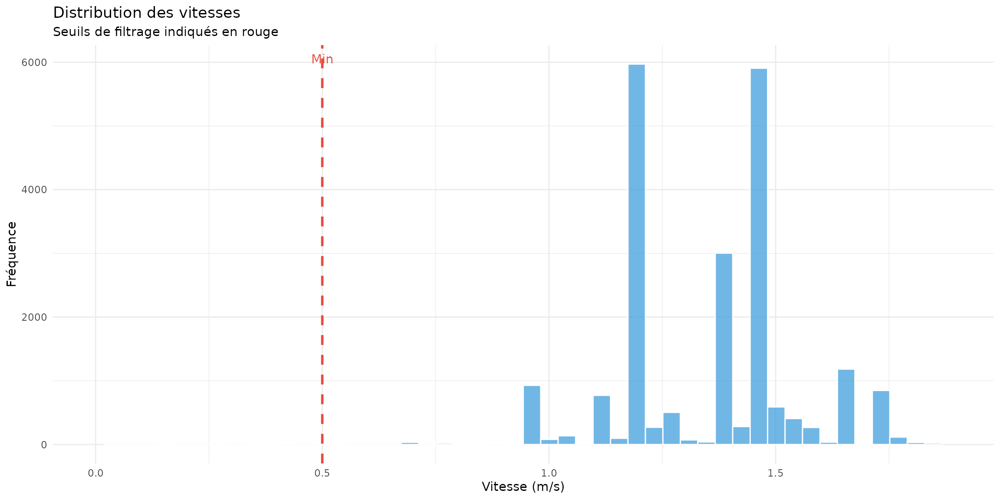
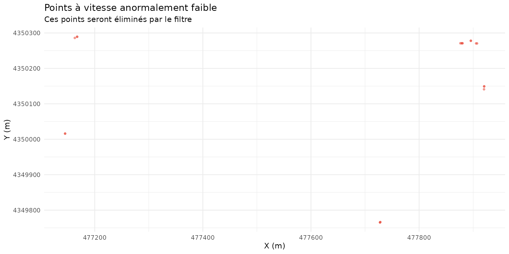
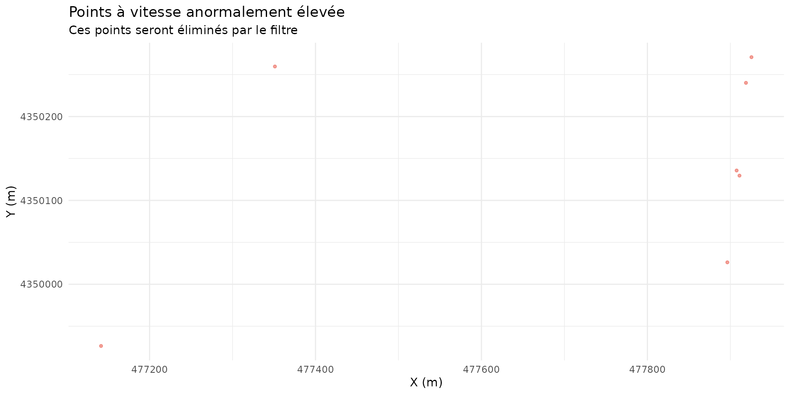
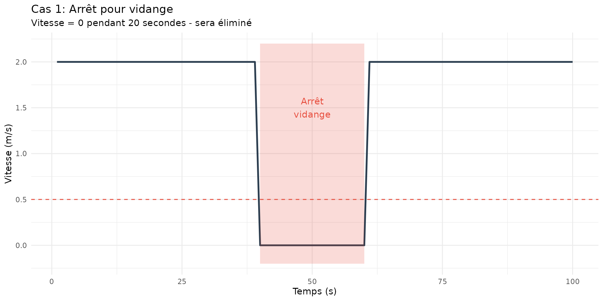
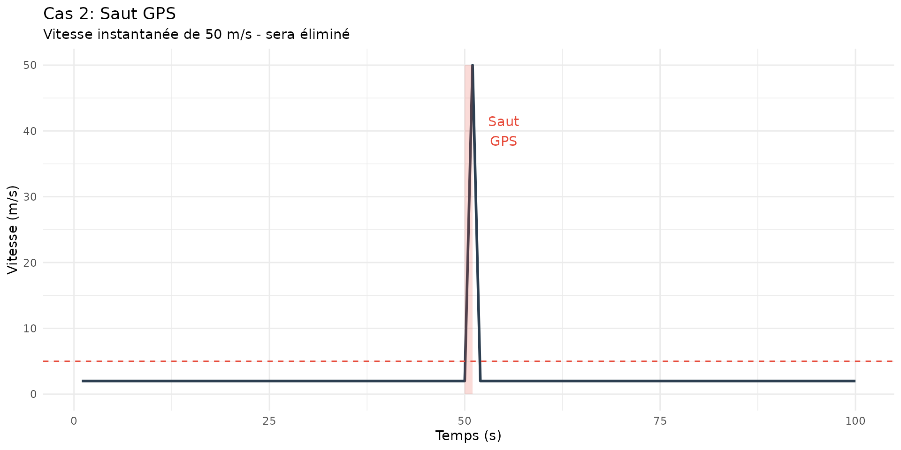

# Filtre de Vitesse - Théorie et Applications

## Introduction

Le filtre de vitesse élimine les points où la moissonneuse se déplace à
une vitesse anormale. Ces anomalies peuvent être causées par : - Des
arrêts ou ralentissements (vitesse trop faible) - Des erreurs GPS
(vitesse trop élevée) - Des manœuvres de demi-tour

## Calcul de la vitesse

### Formule de base

La vitesse est calculée à partir des positions GPS successives :

$$v_{i} = \frac{\sqrt{\left( x_{i} - x_{i - 1} \right)^{2} + \left( y_{i} - y_{i - 1} \right)^{2}}}{\Delta t}$$

Où : - $v_{i}$ = vitesse au point $i$ (m/s) - $x_{i}$, $y_{i}$ =
coordonnées UTM au point $i$ (mètres) - $\Delta t$ = intervalle de temps
entre les points (secondes)

### Implémentation

``` r
library(yieldcleanr)
library(ggplot2)
library(dplyr)

# Charger les données
file_path <- system.file("extdata", "sample1.txt", package = "yieldcleanr")
data_raw <- read_yield_data(file_path)

# Conversion UTM
data_utm <- latlon_to_utm(data_raw)

# Calcul manuel de la vitesse pour illustration
data_calc <- data_utm %>%
  mutate(
    dx = X - lag(X),
    dy = Y - lag(Y),
    distance = sqrt(dx^2 + dy^2),
    velocity_manual = distance / Interval
  )

cat("=== Calcul de la vitesse ===\n")
#> === Calcul de la vitesse ===
cat("Formule: v = √((x₂-x₁)² + (y₂-y₁)²) / Δt\n\n")
#> Formule: v = √((x₂-x₁)² + (y₂-y₁)²) / Δt
cat("Exemple sur les 5 premiers points:\n")
#> Exemple sur les 5 premiers points:
head(data_calc %>% select(X, Y, Interval, distance, velocity_manual), 5)
#> # A tibble: 5 × 5
#>         X        Y Interval distance velocity_manual
#>     <dbl>    <dbl>    <int>    <dbl>           <dbl>
#> 1 477728. 4349765.        1   NA              NA    
#> 2 477728. 4349766.        1    0.333           0.333
#> 3 477728. 4349766.        1    0.759           0.759
#> 4 477728. 4349766.        1    0.375           0.375
#> 5 477729. 4349767.        1    1.03            1.03
```

## Détection des seuils

### Méthode des quantiles

Les seuils sont calculés automatiquement à partir des quantiles de la
distribution des vitesses :

$$v_{min} = Q_{p_{low}}(v) \times scale_{low}$$$$v_{max} = Q_{p_{high}}(v) \times scale_{high}$$

Où : - $Q_{p}$ = quantile à la proportion $p$ - $p_{low}$ = proportion
basse (défaut: 0.02) - $p_{high}$ = proportion haute (défaut: 0.98) -
$scale_{low}$ = facteur d’échelle bas (défaut: 0.5) - $scale_{high}$ =
facteur d’échelle haut (défaut: 1.5)

### Valeurs absolues minimum

Pour éviter d’éliminer des points légitimes, des minimums absolus sont
appliqués :

$$v_{min} = \max\left( v_{min\_ calculé},v_{min\_ abs} \right)$$

Typiquement, $v_{min\_ abs} = 0.5$ m/s (environ 1.8 km/h).

``` r
# Calculer les seuils automatiques
thresholds <- calculate_thresholds(data_utm)

cat("=== Seuils de vitesse calculés ===\n")
#> === Seuils de vitesse calculés ===
cat("Quantile 2%:", round(quantile(data_calc$velocity_manual, 0.02, na.rm = TRUE), 2), "m/s\n")
#> Quantile 2%: 0.95 m/s
cat("Quantile 98%:", round(quantile(data_calc$velocity_manual, 0.98, na.rm = TRUE), 2), "m/s\n")
#> Quantile 98%: 1.72 m/s
cat("\nSeuil minimum:", round(thresholds$velocity$min_velocity, 2), "m/s\n")
#> 
#> Seuil minimum: 0.5 m/s
cat("Seuil maximum:", round(thresholds$velocity$max_velocity, 2), "m/s\n")
#> Seuil maximum: 2.52 m/s
```

## Distribution des vitesses

``` r
# Distribution des vitesses
velocities <- data_calc$velocity_manual[!is.na(data_calc$velocity_manual)]

# Créer le graphique
df_vel <- data.frame(velocity = velocities)

p1 <- ggplot(df_vel, aes(x = velocity)) +
  geom_histogram(bins = 50, fill = "#3498db", alpha = 0.7, color = "white") +
  geom_vline(xintercept = thresholds$velocity$min_velocity, color = "#e74c3c", 
             linetype = "dashed", size = 1) +
  geom_vline(xintercept = thresholds$velocity$max_velocity, color = "#e74c3c", 
             linetype = "dashed", size = 1) +
  annotate("text", x = thresholds$velocity$min_velocity, y = Inf, 
           label = "Min", vjust = 2, color = "#e74c3c") +
  annotate("text", x = thresholds$velocity$max_velocity, y = Inf, 
           label = "Max", vjust = 2, color = "#e74c3c") +
  labs(title = "Distribution des vitesses",
       subtitle = "Seuils de filtrage indiqués en rouge",
       x = "Vitesse (m/s)",
       y = "Fréquence") +
  theme_minimal() +
  xlim(0, quantile(velocities, 0.99))

p1
```



## Application du filtre

### Règle de décision

Un point $i$ est conservé si :

$$v_{min} \leq v_{i} \leq v_{max}$$

Sinon, il est éliminé.

### Exemple d’application

``` r
cat("=== Application du filtre de vitesse ===\n")
#> === Application du filtre de vitesse ===

# Avant filtrage
n_before <- nrow(data_utm)
cat("Points avant filtrage:", n_before, "\n")
#> Points avant filtrage: 21917
cat("Vitesse moyenne:", round(mean(data_calc$velocity_manual, na.rm = TRUE), 2), "m/s\n")
#> Vitesse moyenne: 1.38 m/s
cat("Vitesse min-max:", round(min(data_calc$velocity_manual, na.rm = TRUE), 2), "-",
    round(max(data_calc$velocity_manual, na.rm = TRUE), 2), "m/s\n\n")
#> Vitesse min-max: 0 - 64.36 m/s

# Appliquer le filtre
data_filtered <- filter_data(data_utm, 
                             type = "velocity",
                             min_velocity = thresholds$velocity$min_velocity,
                             max_velocity = thresholds$velocity$max_velocity)

# Après filtrage
n_after <- nrow(data_filtered)
cat("Points après filtrage:", n_after, "\n")
#> Points après filtrage: 21884
cat("Points retirés:", n_before - n_after, "(", 
    round((n_before - n_after)/n_before*100, 1), "%)\n")
#> Points retirés: 33 ( 0.2 %)
```

## Visualisation avant/après

``` r
# Calculer les vitesses pour visualisation
data_viz_before <- data_utm %>%
  mutate(velocity = sqrt((X - lag(X))^2 + (Y - lag(Y))^2) / Interval)

data_viz_after <- data_filtered %>%
  mutate(velocity = sqrt((X - lag(X))^2 + (Y - lag(Y))^2) / Interval)

# Créer les objets sf
sf_before <- sf::st_as_sf(data_viz_before, coords = c("Longitude", "Latitude"), crs = 4326)
sf_after <- sf::st_as_sf(data_viz_after, coords = c("Longitude", "Latitude"), crs = 4326)

# Graphique comparatif
par(mfrow = c(1, 2))

plot(sf_before["velocity"], main = "AVANT - Toutes les vitesses", 
     pch = 19, cex = 0.3, breaks = "jenks", key.pos = NULL)
```


``` r
plot(sf_after["velocity"], main = "APRÈS - Vitesses filtrées", 
     pch = 19, cex = 0.3, breaks = "jenks", key.pos = NULL)
```


## Types d’anomalies détectées

### 1. Vitesse trop faible (arrêts)

``` r
# Identifier les points à vitesse nulle ou très faible
low_vel <- data_calc %>% 
  filter(velocity_manual < 0.5 | is.na(velocity_manual))

cat("Points avec vitesse < 0.5 m/s:", nrow(low_vel), "\n")
#> Points avec vitesse < 0.5 m/s: 19
cat("Causes possibles:\n")
#> Causes possibles:
cat("  - Arrêts de la moissonneuse\n")
#>   - Arrêts de la moissonneuse
cat("  - Manœuvres de demi-tour\n")
#>   - Manœuvres de demi-tour
cat("  - Problèmes de transmission GPS\n")
#>   - Problèmes de transmission GPS

# Visualiser
if (nrow(low_vel) > 0) {
  ggplot(low_vel, aes(x = X, y = Y)) +
    geom_point(color = "#e74c3c", alpha = 0.5, size = 1) +
    labs(title = "Points à vitesse anormalement faible",
         subtitle = "Ces points seront éliminés par le filtre",
         x = "X (m)", y = "Y (m)") +
    theme_minimal()
}
```



### 2. Vitesse trop élevée (erreurs GPS)

``` r
# Identifier les points à vitesse excessive
high_vel <- data_calc %>% 
  filter(velocity_manual > 10)

cat("\nPoints avec vitesse > 10 m/s:", nrow(high_vel), "\n")
#> 
#> Points avec vitesse > 10 m/s: 7
cat("Causes possibles:\n")
#> Causes possibles:
cat("  - Sauts GPS (perte de signal)\n")
#>   - Sauts GPS (perte de signal)
cat("  - Points mal synchronisés\n")
#>   - Points mal synchronisés
cat("  - Erreurs de positionnement\n")
#>   - Erreurs de positionnement

# Visualiser
if (nrow(high_vel) > 0) {
  ggplot(high_vel, aes(x = X, y = Y)) +
    geom_point(color = "#e74c3c", alpha = 0.5, size = 1) +
    labs(title = "Points à vitesse anormalement élevée",
         subtitle = "Ces points seront éliminés par le filtre",
         x = "X (m)", y = "Y (m)") +
    theme_minimal()
}
```



## Paramètres recommandés

### Par type de culture

| Culture  | Vitesse min | Vitesse max | Remarques                     |
|----------|-------------|-------------|-------------------------------|
| **Maïs** | 0.5 m/s     | 4-6 m/s     | Vitesse de travail: 2-4 m/s   |
| **Soja** | 0.5 m/s     | 4-5 m/s     | Vitesse de travail: 1.5-3 m/s |
| **Blé**  | 0.5 m/s     | 5-7 m/s     | Vitesse de travail: 2-5 m/s   |

### Paramètres de la fonction

| Paramètre | Description                    | Défaut     |
|:----------|:-------------------------------|:-----------|
| type      | Type de filtre (‘velocity’)    | ‘velocity’ |
| min_value | Vitesse minimale (m/s)         | auto       |
| max_value | Vitesse maximale (m/s)         | auto       |
| vllim     | Quantile bas pour calcul auto  | 0.02       |
| vulim     | Quantile haut pour calcul auto | 0.98       |
| vscale    | Facteur d’échelle haut         | 1.5        |
| minv_abs  | Minimum absolu (m/s)           | 0.5        |

Paramètres du filtre de vitesse

## Exemples de cas réels

### Cas 1: Arrêt pour vidange

``` r
# Simuler un arrêt
set.seed(123)
time <- 1:100
x <- c(seq(0, 40, length.out = 40), 
       rep(40, 20),  # Arrêt
       seq(40, 80, length.out = 40))
y <- seq(0, 100, length.out = 100)
velocity <- c(rep(2, 39), rep(0, 21), rep(2, 40))

df_case1 <- data.frame(time = time, x = x, y = y, velocity = velocity)

p_case1 <- ggplot(df_case1, aes(x = time)) +
  geom_line(aes(y = velocity), color = "#2c3e50", size = 1) +
  geom_hline(yintercept = 0.5, color = "#e74c3c", linetype = "dashed") +
  annotate("rect", xmin = 40, xmax = 60, ymin = -0.2, ymax = 2.2,
           alpha = 0.2, fill = "#e74c3c") +
  annotate("text", x = 50, y = 1.5, label = "Arrêt\nvidange", color = "#e74c3c") +
  labs(title = "Cas 1: Arrêt pour vidange",
       subtitle = "Vitesse = 0 pendant 20 secondes - sera éliminé",
       x = "Temps (s)", y = "Vitesse (m/s)") +
  theme_minimal()

p_case1
```



### Cas 2: Saut GPS

``` r
# Simuler un saut GPS
time <- 1:100
x <- c(seq(0, 50, length.out = 50), 
       100,  # Saut
       seq(102, 150, length.out = 49))
y <- seq(0, 100, length.out = 100)
velocity <- c(rep(2, 50), 50, rep(2, 49))  # Pic de vitesse

df_case2 <- data.frame(time = time, x = x, y = y, velocity = velocity)

p_case2 <- ggplot(df_case2, aes(x = time)) +
  geom_line(aes(y = velocity), color = "#2c3e50", size = 1) +
  geom_hline(yintercept = 5, color = "#e74c3c", linetype = "dashed") +
  annotate("rect", xmin = 50, xmax = 51, ymin = 0, ymax = 50,
           alpha = 0.2, fill = "#e74c3c") +
  annotate("text", x = 55, y = 40, label = "Saut\nGPS", color = "#e74c3c") +
  labs(title = "Cas 2: Saut GPS",
       subtitle = "Vitesse instantanée de 50 m/s - sera éliminé",
       x = "Temps (s)", y = "Vitesse (m/s)") +
  theme_minimal()

p_case2
```



## Conclusion

Le filtre de vitesse est essentiel pour : 1. **Éliminer les arrêts** qui
créent des rendements artificiels 2. **Supprimer les erreurs GPS** qui
déforment la trajectoire 3. **Stabiliser le calcul du rendement** qui
dépend de la vitesse

**Points clés :** - La vitesse est calculée à partir des positions GPS
successives - Les seuils peuvent être calculés automatiquement ou
définis manuellement - Un minimum absolu de 0.5 m/s évite d’éliminer les
points légitimes - Le filtre doit être appliqué après la conversion UTM

**Recommandation** : Toujours visualiser la distribution des vitesses
avant et après filtrage pour valider les seuils choisis.
