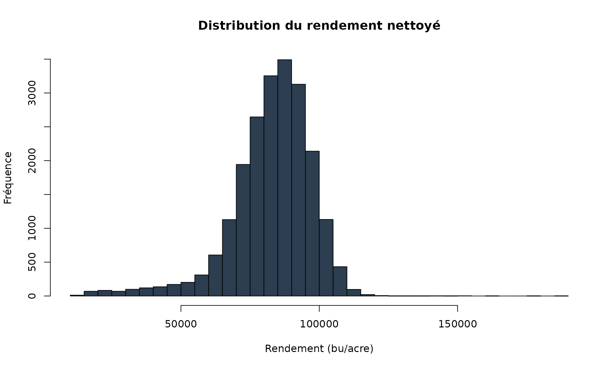

# Filtres de Nettoyage des Données de Rendement

## Introduction

Le package **yieldcleanr** propose plusieurs filtres pour nettoyer les
données de rendement agricole. Chaque filtre cible un type spécifique de
problème dans les données. Cette vignette documente chaque filtre en
détail.

## Filtres de Base

### Filtre Header Status (`filter_header_status`)

Ce filtre garde uniquement les points où la moissonneuse est en position
de travail active.

Il permet d’exclure les manoeuvres, les demi-tours et les phases où la
coupe est relevee. Dans la pratique, c’est souvent le premier filtre a
appliquer pour eviter d’introduire des rendements nuls ou aberrants dans
les calculs.

**HeaderStatus :** - **1** = Harvesting actif - **33** = Header abaissé
(actif) - **0** = Header levé (inactif, sera éliminé)

``` r
library(yieldcleanr)
library(dplyr)
#> 
#> Attaching package: 'dplyr'
#> The following objects are masked from 'package:stats':
#> 
#>     filter, lag
#> The following objects are masked from 'package:base':
#> 
#>     intersect, setdiff, setequal, union

# Charger les données d'exemple
data <- read_yield_data(system.file("extdata", "sample1.txt", package = "yieldcleanr"))
#> Distance detectee en pouces (moyenne: 53.6 ) - conversion en metres
#> Swath detecte en pouces (moyenne: 288 ) - conversion en metres

cat("Avant filtrage:", nrow(data), "lignes\n")
#> Avant filtrage: 21917 lignes
cat("HeaderStatus avant:", paste(unique(data$HeaderStatus), collapse = ", "), "\n")
#> HeaderStatus avant: 1, 0

# Appliquer le filtre header status
data_filtered <- filter_header_status(data)
#> Header Status filter: 788 points éliminés (header non actif, valeurs acceptées:
#> 1, 33 )

cat("Après filtrage:", nrow(data_filtered), "lignes\n")
#> Après filtrage: 21129 lignes
```

**Paramètres :** \| Paramètre \| Description \| Défaut \|
\|———–\|————-\|——–\| \| `header_values` \| Valeurs acceptées pour header
actif \| `c(1, 33)` \|

------------------------------------------------------------------------

### Filtre GPS Status (`filter_gps_status`)

Élimine les points avec un signal GPS de mauvaise qualité.

Un signal GPS degrade provoque des sauts de position qui faussent la
vitesse et les polygones. Ce filtre stabilise la trajectoire en excluant
les relevés les moins fiables.

**Valeurs GPSStatus courantes :** - 4-7 = Bon signal - 1-3 = Signal
faible

``` r
# Créer des données de test avec GPSStatus variable (8 premiers points)
data_test <- data |>
  slice(1:8) |>
  mutate(GPSStatus = c(2, 4, 5, 7, 4, 3, 6, 4))

cat("Avant filtrage:", nrow(data_test), "lignes\n")
#> Avant filtrage: 8 lignes
cat("GPSStatus avant:", paste(data_test$GPSStatus, collapse = ", "), "\n")
#> GPSStatus avant: 2, 4, 5, 7, 4, 3, 6, 4

# Filtrer avec GPSStatus >= 4
data_gps <- filter_gps_status(data_test, min_gps_status = 4)
#> GPS Status filter: 2 points éliminés (GPS status < 4 )

cat("Après filtrage (GPS >= 4):", nrow(data_gps), "lignes\n")
#> Après filtrage (GPS >= 4): 6 lignes
cat("GPSStatus après:", paste(data_gps$GPSStatus, collapse = ", "), "\n")
#> GPSStatus après: 4, 5, 7, 4, 6, 4
```

------------------------------------------------------------------------

### Filtre DOP (`filter_dop`)

Élimine les points avec une mauvaise précision GPS (Dilution of
Precision).

Le DOP mesure la geometrie des satellites : plus il est eleve, plus la
position est incertaine. En limitant le DOP, on reduit les points isoles
qui degradent les cartes de rendement.

Un DOP élevé (\> 10) indique une mauvaise géométrie satellite et donc
une position imprécise.

``` r
# Créer des données de test avec DOP variable (8 premiers points)
data_test <- data |>
  slice(1:8) |>
  mutate(DOP = c(5, 15, 8, 5, 10, 12, 3, 7))

cat("Avant filtrage:", nrow(data_test), "lignes\n")
#> Avant filtrage: 8 lignes

# Filtrer avec DOP <= 10
data_dop <- filter_dop(data_test, max_dop = 10)
#> DOP filter: 2 points éliminés (DOP > 10 )

cat("Après filtrage (DOP <= 10):", nrow(data_dop), "lignes\n")
#> Après filtrage (DOP <= 10): 6 lignes
```

------------------------------------------------------------------------

### Filtre Vitesse (`filter_velocity`)

Filtre les points selon la vitesse de déplacement de la moissonneuse.

Les vitesses tres faibles correspondent souvent a des arrets ou des
debuts de passage. Les vitesses tres elevees signalent des erreurs GPS
ou des points mal synchronises. Adapter la plage de vitesse au type de
culture et a la vitesse de travail reelle.

**Plage de vitesse typique :** 0.5 - 10 m/s

Les vitesses trop faibles (\< 0.5 m/s) indiquent souvent un arrêt. Les
vitesses excessives (\> 10 m/s) peuvent indiquer des erreurs GPS.

``` r
# Les données doivent d'abord être converties en UTM
data_utm <- latlon_to_utm(data)
#> Zone UTM détectée: 15

cat("Données converties en UTM:\n")
#> Données converties en UTM:
cat("  X range:", round(min(data_utm$X), 0), "-", round(max(data_utm$X), 0), "\n")
#>   X range: 477128 - 477929
cat("  Y range:", round(min(data_utm$Y), 0), "-", round(max(data_utm$Y), 0), "\n")
#>   Y range: 4349765 - 4350292

# Filtrer par vélocité (0.5 - 10 m/s)
data_vel <- filter_velocity(data_utm, min_velocity = 0.5, max_velocity = 10)
#> Velocity filter: 26 points éliminés (vitesse hors plage: 0.5 - 10 )

cat("Points conservés après filtre vélocité:", nrow(data_vel), "\n")
#> Points conservés après filtre vélocité: 21891
```

------------------------------------------------------------------------

### Filtre des Limites (`filter_bounds`)

Élimine les points qui sont à l’extérieur des limites géographiques du
champ.

Ce filtre s’appuie sur des bornes definies a partir du contour du champ
ou des quantiles de position. Il est efficace pour retirer les points
collectes hors parcelle.

Utile pour éliminer les “flyers” GPS ou les données collectées
avant/après la récolte.

``` r
# Définir les limites du champ (en UTM)
bounds <- list(
  min_x = 434840,
  max_x = 435995,
  min_y = 5261127,
  max_y = 5262262
)

# Filtrer
data_bounds <- filter_bounds(data_utm, bounds = bounds, coord_type = "utm")
#> Bounds filter: 21917 points éliminés (hors limites du champ)

cat("Points dans les limites du champ:", nrow(data_bounds), "\n")
#> Points dans les limites du champ: 0
```

------------------------------------------------------------------------

### Filtre de Plage de Rendement (`filter_yield_range`)

Élimine les points avec des rendements hors plage.

Le filtrage de plage supprime les valeurs physiquement impossibles ou
incoherentes. Il peut etre regle manuellement par culture ou
automatiquement via l’ecart-type.

**Plages de rendement typiques :** - Maïs : 50 - 350 bu/acre - Soja :
15 - 80 bu/acre

``` r
# Les données doivent d'abord avoir une colonne de rendement
data_yield <- convert_flow_to_yield(data_utm)
#> Yield calculé: 81059 bu/acre (lbs/bu = 60 )

# Filtrer avec une plage de rendement raisonnable pour le maïs
data_yield_filtered <- filter_yield_range(
  data_yield,
  min_yield = 50,
  max_yield = 350,
  yield_column = "Yield_buacre"
)
#> Yield range filter: 21905 points éliminés (rendement hors plage: 50 - 350 )

cat("Points après filtre rendement (50-350 bu/acre):", nrow(data_yield_filtered), "\n")
#> Points après filtre rendement (50-350 bu/acre): 0
cat("Rendement moyen:", round(mean(data_yield_filtered$Yield_buacre, na.rm = TRUE), 1), "bu/acre\n")
#> Rendement moyen: NaN bu/acre
```

------------------------------------------------------------------------

### Filtre de Plage d’Humidite (`filter_moisture_range`)

Filtre les points selon le taux d’humidité du grain.

L’humidite peut deriver en fin de journee ou lors des changements de
variete. Ce filtre supprime les extremes qui perturbent les conversions
et les seuils de rendement.

**Plages d’humidite typiques :** - Maïs : 10 - 40% - Soja : 8 - 20%

``` r
# Créer des données de test avec humidité variable (8 premiers points)
data_test <- data |>
  slice(1:8) |>
  mutate(Moisture = c(5, 15, 35, 45, 25, 30, 12, 20))

cat("Avant filtrage:", nrow(data_test), "lignes\n")
#> Avant filtrage: 8 lignes
cat("Humidité avant:", paste(data_test$Moisture, collapse = ", "), "\n")
#> Humidité avant: 5, 15, 35, 45, 25, 30, 12, 20

# Filtrer pour le maïs (10-40%)
data_moisture <- filter_moisture_range(data_test, min_moisture = 10, max_moisture = 40)
#> Moisture range filter: 2 points éliminés (humidité hors plage: 10 - 40 )

cat("Après filtrage (10-40%):", nrow(data_moisture), "lignes\n")
#> Après filtrage (10-40%): 6 lignes
```

------------------------------------------------------------------------

## Filtres Avancés

### Suppression du Chevauchement (`remove_overlap`)

Élimine les points de chevauchement en utilisant une grille spatiale.

Lorsque plusieurs passages se recouvrent, certaines zones sont
sur-echantillonnees. Le filtre de chevauchement retire les cellules trop
denses pour mieux representer la couverture reelle de la recolte.

Les zones de chevauchement (passes successives sur la même zone) sont
identifiées et les points en excès sont éliminés.

``` r
# Appliquer le filtre overlap
data_overlap <- remove_overlap(data_utm, cellsize = 0.3, max_pass = 50)
#> Overlap filter complete: Cellsize: 0.3 Max Pass: 50 - 0 points éliminés

cat("Points après suppression overlap:", nrow(data_overlap), "\n")
#> Points après suppression overlap: 21917
```

**Paramètres :** \| Paramètre \| Description \| Défaut \|
\|———–\|————-\|——–\| \| `cellsize` \| Taille des cellules de grille
(mètres) \| 0.3 \| \| `max_pass` \| Nombre max de passages avant
élimination \| 50 \|

------------------------------------------------------------------------

### Filtre ET Local (`filter_local_std`)

Élimine les points aberrants en utilisant un voisinage de passages
adjacents.

Ce filtre compare chaque point a la moyenne locale de son passage. Il
est utile pour enlever les pics ponctuels tout en preservant les
variations reelles.

Les points dont le rendement s’écarte de plus de `std_limit`
écarts-types de la moyenne locale sont éliminés.

``` r
# Créer des données de test avec un outlier (8 premiers points)
data_test <- data_utm |>
  slice(1:8) |>
  mutate(
    Flow = c(10, 150, 155, 152, 148, 600, 151, 149),  # 600 = outlier
    .row_id = 1:8
  )

cat("Avant filtrage STD local:\n")
#> Avant filtrage STD local:
print(data_test |> select(.row_id, Flow))
#> # A tibble: 8 × 2
#>   .row_id  Flow
#>     <int> <dbl>
#> 1       1    10
#> 2       2   150
#> 3       3   155
#> 4       4   152
#> 5       5   148
#> 6       6   600
#> 7       7   151
#> 8       8   149

# Appliquer le filtre
data_std <- filter_local_std(data_test, swath_window = 5, std_limit = 3)
#> Local STD Filter complete: Swath : 5 STDLimit : 3 - 0 points éliminés

cat("\nAprès filtrage STD local:\n")
#> 
#> Après filtrage STD local:
print(data_std |> select(.row_id, Flow))
#> # A tibble: 8 × 2
#>   .row_id  Flow
#>     <int> <dbl>
#> 1       1    10
#> 2       2   150
#> 3       3   155
#> 4       4   152
#> 5       5   148
#> 6       6   600
#> 7       7   151
#> 8       8   149
```

------------------------------------------------------------------------

### Filtre Fenetre Glissante (`filter_sliding_window`)

Applique un filtre à fenêtre glissante pour éliminer les valeurs
aberrantes basées sur les voisins temporels.

Il agit comme un lissage temporel : les valeurs trop eloignees de la
tendance locale sont retirees. Utile lorsque les anomalies sont courtes
mais frequentes.

``` r
# Créer des données de test
data_test <- data_utm |>
  mutate(
    Flow = c(150, 152, 155, 158, 500, 153, 151, 149),  # 500 = outlier
    .row_id = 1:8
  )

# Appliquer le filtre
data_sliding <- filter_sliding_window(data_test, window_size = 5, n_std = 2)
```

------------------------------------------------------------------------

## Filtres de Correction de Position

### Filtre de Position (`apply_position_filter`)

Élimine les “flyers” GPS en utilisant une enveloppe inter-quantile.

Ce filtre construit une enveloppe spatiale et elimine les points tres
eloignes. Il est souvent applique apres la conversion UTM pour
stabiliser la geometrie.

``` r
# Calculer les seuils automatiques
thresholds <- calculate_auto_thresholds(data_utm)
#> === Automatic Threshold Calculation (AYCE) ===
#> Yield: Flow MIN = 0 MAX = 19.48
#> Velocity: MIN = 0.5 MAX = 2.89
#> Position: X[ 477042 - 477999 ]
#> Position: Y[ 4349680 - 4350386 ]

cat("Position envelope:\n")
#> Position envelope:
cat("  X:", round(thresholds$pos_x_min, 0), "-", round(thresholds$pos_x_max, 0), "\n")
#>   X: 477042 - 477999
cat("  Y:", round(thresholds$pos_y_min, 0), "-", round(thresholds$pos_y_max, 0), "\n")
#>   Y: 4349680 - 4350386

# Appliquer le filtre
data_pos <- apply_position_filter(data_utm, thresholds)

cat("\nPoints après filtre position:", nrow(data_pos), "\n")
#> 
#> Points après filtre position: 21917
```

------------------------------------------------------------------------

## Filtres de Correction de Délai

### Correction du Delai de Flux (`apply_flow_delay`)

Compense le délai entre le capteur de flux et la position GPS.

Un delai incorrect decale la position des rendements et produit des
bandes obliques. Ce correctif aligne le flux et la position afin
d’ameliorer la coherence spatiale.

Le flux de grain est décalé temporellement pour correspondre à la
position.

``` r
# Créer des données de test
data_test <- data_utm |>
  head(20) |>
  mutate(.row_id = 1:20)

cat("Avant correction délai:", nrow(data_test), "lignes\n")
#> Avant correction délai: 20 lignes

# Appliquer une correction de délai de 2 observations
data_delay <- apply_flow_delay(data_test, delay = 2)
#> Flow delay correction: 2 seconds, 2 points éliminés (valeurs NA)

cat("Après correction délai (2s):", nrow(data_delay), "lignes\n")
#> Après correction délai (2s): 18 lignes
```

------------------------------------------------------------------------

### Correction du Delai d’Humidite (`apply_moisture_delay`)

Compense le délai entre la mesure d’humidité et la position GPS.

L’humidite est souvent mesuree avec un decalage plus long que le flux.
Cette correction aligne les courbes d’humidite avec la position pour des
analyses fiables.

``` r
# Appliquer une correction de délai de 15 observations
data_moist <- apply_moisture_delay(data_test, delay = 15)
```

------------------------------------------------------------------------

## Filtres AYCE Spécialisés

### Filtre de Chevauchement Bitmap (`apply_overlap_filter`)

Implémente la méthode rasterisée de Han et al. (1997) pour détecter et
éliminer les zones de chevauchement.

Ce filtre calcule un ratio de chevauchement pour chaque point et elimine
les zones recoltees plusieurs fois. Il est plus fin que `remove_overlap`
sur des donnees denses.

Ce filtre est plus sophistiqué que `remove_overlap` car il calcule le
ratio de chevauchement pour chaque point.

``` r
# Appliquer le filtre overlap bitmap
data_bitmap <- apply_overlap_filter(data_utm, cellsize = 0.3, overlap_threshold = 0.5)
#> === Bitmap Overlap Filter ===
#> Donnees etendues - utilisation du bitmap sparse
#> Overlap ratio: min 0 max 1
#> Overlap filter: 3 points éliminés (0%)

cat("Points après filtre overlap bitmap:", nrow(data_bitmap), "\n")
#> Points après filtre overlap bitmap: 21914
```

------------------------------------------------------------------------

### Filtre ET Localise (`apply_local_sd_filter`)

Crée une grille spatiale et élimine les points aberrants basés sur
l’écart-type local.

La methode s’appuie sur une grille fixe plutot que sur les passages, ce
qui la rend plus robuste lorsque les passages sont mal identifies ou
tres irreguliers.

Plus sophistiqué que `filter_local_std` car il utilise une grille
spatiale plutôt que des passages.

``` r
# Appliquer le filtre SD localisé
data_lsd <- apply_local_sd_filter(data_utm, n_swaths = 5, lsd_limit = 3)
#> === Localized SD Filter ===
#> Local SD filter: 565 points éliminés (2.6%)

cat("Points après filtre SD localisé:", nrow(data_lsd), "\n")
#> Points après filtre SD localisé: 21352
```

------------------------------------------------------------------------

## Pipeline Complet avec AYCE

### Utilisation combinée des filtres

``` r
# Pipeline de nettoyage complet
file_path <- system.file("extdata", "sample1.txt", package = "yieldcleanr")
data_raw <- read_yield_data(file_path)
#> Distance detectee en pouces (moyenne: 53.6 ) - conversion en metres
#> Swath detecte en pouces (moyenne: 288 ) - conversion en metres

# Étape 1: Conversion UTM
data <- latlon_to_utm(data_raw)
#> Zone UTM détectée: 15

# Étape 2: Conversion rendement
data <- convert_flow_to_yield(data)
#> Yield calculé: 81059 bu/acre (lbs/bu = 60 )

# Étape 3: PCDI
pcdi <- apply_pcdi(data, delay_range = 0:20, n_iterations = 5)
#> === PCDI: Phase Correlation Delay Identification ( Flow ) ===
#> Delai optimal ( Flow ): 0 secondes
#> RSC a l'optimal : 0.2829
#> Stabilite (CV) : 0.001

# Étape 4: Calcul seuils automatiques
thresholds <- calculate_auto_thresholds(data)
#> === Automatic Threshold Calculation (AYCE) ===
#> Yield: Yield_buacre MIN = 0 MAX = 192321.25
#> Velocity: MIN = 0.5 MAX = 2.89
#> Position: X[ 477042 - 477999 ]
#> Position: Y[ 4349680 - 4350386 ]

# Étape 5: Appliquer les filtres
data_clean <- data |>
  apply_position_filter(thresholds) |>
  filter_velocity(thresholds$min_velocity, thresholds$max_velocity) |>
  filter_yield_range(thresholds$min_yield, thresholds$max_yield) |>
  apply_overlap_filter(cellsize = 0.3, overlap_threshold = 0.5) |>
  apply_local_sd_filter(n_swaths = 5, lsd_limit = 3)
#> === Localized SD Filter ===
#> === Bitmap Overlap Filter ===
#> Velocity filter: 29 points éliminés (vitesse hors plage: 0.5 - 2.88864430393987 )
#> Yield range filter: 2 points éliminés (rendement hors plage: 0 - 192321.2 )
#> Donnees etendues - utilisation du bitmap sparse
#> Overlap ratio: min 0 max 1
#> Overlap filter: 1 points éliminés (0%)
#> Local SD filter: 560 points éliminés (2.6%)

# Résumé
cat("=== RÉSUMÉ DU NETTOYAGE ===\n")
#> === RÉSUMÉ DU NETTOYAGE ===
cat("Points bruts:", nrow(data_raw), "\n")
#> Points bruts: 21917
cat("Points nettoyés:", nrow(data_clean), "\n")
#> Points nettoyés: 21313
cat("Taux de rétention:", round(nrow(data_clean)/nrow(data_raw)*100, 1), "%\n")
#> Taux de rétention: 97.2 %
cat("Rendement moyen:", round(mean(data_clean$Yield_buacre, na.rm = TRUE), 1), "bu/acre\n")
#> Rendement moyen: 82868 bu/acre

# Histogramme
hist(data_clean$Yield_buacre, breaks = 30, col = "#2C3E50", alpha = 0.7,
     main = "Distribution du rendement nettoyé",
     xlab = "Rendement (bu/acre)", ylab = "Fréquence")
```



------------------------------------------------------------------------

## Résumé des Filtres

| Filtre         | Fonction                                                           | Usage Principal                              |
|----------------|--------------------------------------------------------------------|----------------------------------------------|
| Header Status  | [`filter_header_status()`](../reference/filter_header_status.md)   | Éliminer points quand moissonneuse à l’arrêt |
| GPS Status     | [`filter_gps_status()`](../reference/filter_gps_status.md)         | Éliminer points avec mauvais signal GPS      |
| DOP            | [`filter_dop()`](../reference/filter_dop.md)                       | Éliminer points avec faible précision GPS    |
| Velocity       | [`filter_velocity()`](../reference/filter_velocity.md)             | Éliminer points avec vitesse anormale        |
| Bounds         | [`filter_bounds()`](../reference/filter_bounds.md)                 | Éliminer points hors du champ                |
| Yield Range    | [`filter_yield_range()`](../reference/filter_yield_range.md)       | Éliminer rendements aberrants                |
| Moisture       | [`filter_moisture_range()`](../reference/filter_moisture_range.md) | Éliminer points avec humidité anormale       |
| Overlap        | [`remove_overlap()`](../reference/remove_overlap.md)               | Éliminer chevauchements (grille simple)      |
| Local STD      | [`filter_local_std()`](../reference/filter_local_std.md)           | Éliminer outliers par voisinage              |
| Sliding Window | [`filter_sliding_window()`](../reference/filter_sliding_window.md) | Éliminer outliers temporels                  |
| Position       | [`apply_position_filter()`](../reference/apply_position_filter.md) | Éliminer flyers GPS                          |
| Flow Delay     | [`apply_flow_delay()`](../reference/apply_flow_delay.md)           | Corriger délai flux-position                 |
| Moisture Delay | [`apply_moisture_delay()`](../reference/apply_moisture_delay.md)   | Corriger délai humidité-position             |
| Bitmap Overlap | [`apply_overlap_filter()`](../reference/apply_overlap_filter.md)   | Éliminer chevauchements (méthode raster)     |
| Local SD       | [`apply_local_sd_filter()`](../reference/apply_local_sd_filter.md) | Éliminer outliers par grille spatiale        |
