# Guide Complet du Nettoyage de Données de Rendement

## Introduction

Ce guide présente une analyse complète du nettoyage de données de
rendement agricole en utilisant le package **yieldcleanr**. Nous
analysons en détail 4 échantillons de données réelles provenant de
moissonneuses-batteuses, en montrant l’effet de chaque filtre du
pipeline AYCE (Auto Yield Cleaning Engine).

### Installation et chargement

``` r
library(yieldcleanr)
library(dplyr)
library(ggplot2)
library(sf)
library(gridExtra)
```

## Vue d’ensemble des échantillons

Le package inclut 4 fichiers de données d’exemple :

| Fichier         | Culture    | Points bruts | Points nettoyés | Rétention |
|-----------------|------------|--------------|-----------------|-----------|
| **sample1.txt** | Soja       | 21,917       | 21,011          | 95.9%     |
| **sample2.txt** | Maïs       | 36,869       | 33,072          | 89.7%     |
| **sample3.txt** | Maïs       | 31,815       | 29,939          | 94.1%     |
| **sample4.txt** | Maïs blanc | 19,495       | 18,727          | 96.1%     |

## Analyse détaillée par échantillon

### Sample 1 - Soja

#### Données brutes

``` r
file_path <- system.file("extdata", "sample1.txt", package = "yieldcleanr")
data_raw_s1 <- read_yield_data(file_path)

cat("=== SAMPLE 1 - SOJA ===\n")
#> === SAMPLE 1 - SOJA ===
cat("Points bruts:", nrow(data_raw_s1), "\n")
#> Points bruts: 21917
cat("Flow (lbs/sec):\n")
#> Flow (lbs/sec):
cat("  Moyenne:", round(mean(data_raw_s1$Flow, na.rm = TRUE), 2), "\n")
#>   Moyenne: 7.64
cat("  Écart-type:", round(sd(data_raw_s1$Flow, na.rm = TRUE), 2), "\n")
#>   Écart-type: 1.9
cat("  Min-Max:", round(min(data_raw_s1$Flow, na.rm = TRUE), 2), "-", 
    round(max(data_raw_s1$Flow, na.rm = TRUE), 2), "\n")
#>   Min-Max: 0 - 12.61
```

#### Pipeline de nettoyage étape par étape

``` r
# Étape 1: Conversion UTM (sans conversion en rendement)
data_s1 <- latlon_to_utm(data_raw_s1)

# Étape 2: Delay Adjustment (sur Flow, pas sur Yield)
delay_result_s1 <- optimize_delays(data_s1, type = "flow", delay_range = -25:25, n_iterations = 3, noise_level = 0.03)
cat("\n🔧 Delay Adjustment - Délai optimal:", delay_result_s1$delays$flow, "secondes\n")
#> 
#> 🔧 Delay Adjustment - Délai optimal: 2 secondes

if (!is.null(delay_result_s1$data)) {
  data_s1 <- delay_result_s1$data
}

# Étape 3: Conversion en rendement APRÈS delay adjustment
data_s1 <- convert_flow_to_yield(data_s1)

# Étape 4: Seuils automatiques
thresholds_s1 <- calculate_thresholds(data_s1)
cat("\n📈 Seuils calculés:\n")
#> 
#> 📈 Seuils calculés:
cat("  Vitesse:", round(thresholds_s1$velocity$min_velocity, 2), "-", round(thresholds_s1$velocity$max_velocity, 2), "m/s\n")
#>   Vitesse: 0.5 - 2.52 m/s
cat("  Rendement:", round(thresholds_s1$yield$min_yield, 1), "-", round(thresholds_s1$yield$max_yield, 1), "kg/ha\n")
#>   Rendement: 1103 - 5932.1 kg/ha

# Étape 5-8: Filtres successifs
cat("\n🔧 FILTRES APPLIQUÉS:\n")
#> 
#> 🔧 FILTRES APPLIQUÉS:

# Filtre vitesse
n_before <- nrow(data_s1)
data_s1 <- filter_data(data_s1, type = "velocity", 
                       min_velocity = thresholds_s1$velocity$min_velocity, 
                       max_velocity = thresholds_s1$velocity$max_velocity)
removed_vel <- n_before - nrow(data_s1)
cat("  Vitesse:", removed_vel, "points retirés (", round(removed_vel/n_before*100, 1), "%)\n")
#>   Vitesse: 34 points retirés ( 0.2 %)

# Filtre humidité
n_before <- nrow(data_s1)
data_s1 <- filter_data(data_s1, type = "moisture", n_std = 3)
removed_moist <- n_before - nrow(data_s1)
cat("  Humidité:", removed_moist, "points retirés (", round(removed_moist/n_before*100, 1), "%)\n")
#>   Humidité: 303 points retirés ( 1.4 %)

# Filtre chevauchement
n_before <- nrow(data_s1)
data_s1 <- detect_anomalies(data_s1, type = "overlap", cellsize = 0.3, overlap_threshold = 0.5)
removed_overlap <- n_before - nrow(data_s1)
cat("  Chevauchement:", removed_overlap, "points retirés (", round(removed_overlap/n_before*100, 1), "%)\n")
#>   Chevauchement: 0 points retirés ( 0 %)

# Filtre écart-type local
n_before <- nrow(data_s1)
data_s1 <- detect_anomalies(data_s1, type = "local_sd", n_swaths = 5, lsd_limit = 3)
removed_lsd <- n_before - nrow(data_s1)
cat("  Écart-type local:", removed_lsd, "points retirés (", round(removed_lsd/n_before*100, 1), "%)\n")
#>   Écart-type local: 145 points retirés ( 0.7 %)

# Résultat final
cat("\n📊 RÉSULTAT FINAL\n")
#> 
#> 📊 RÉSULTAT FINAL
cat("Points nettoyés:", nrow(data_s1), "\n")
#> Points nettoyés: 21423
cat("Taux de rétention:", round(nrow(data_s1)/nrow(data_raw_s1)*100, 1), "%\n")
#> Taux de rétention: 97.7 %
cat("Rendement moyen:", round(mean(data_s1$Yield_kg_ha, na.rm = TRUE), 1), "kg/ha\n")
#> Rendement moyen: 3541.3 kg/ha
cat("CV final:", round(sd(data_s1$Yield_kg_ha, na.rm = TRUE) / mean(data_s1$Yield_kg_ha, na.rm = TRUE) * 100, 1), "%\n")
#> CV final: 21.3 %
```

#### Visualisation avant/après

``` r
# Créer les objets sf pour visualisation
sf_raw <- sf::st_as_sf(data_raw_s1, coords = c("Longitude", "Latitude"), crs = 4326)
sf_clean <- sf::st_as_sf(data_s1, coords = c("Longitude", "Latitude"), crs = 4326)

# Convertir Flow brut en kg/ha pour comparaison
sf_raw$Yield_kg_ha <- sf_raw$Flow * 0.453592 * 3600 / 4046 * 1000

par(mfrow = c(1, 2))
plot(sf_raw["Yield_kg_ha"], main = "AVANT - Sample 1 (Soja)", 
     pch = 19, cex = 0.3, breaks = "jenks")
```

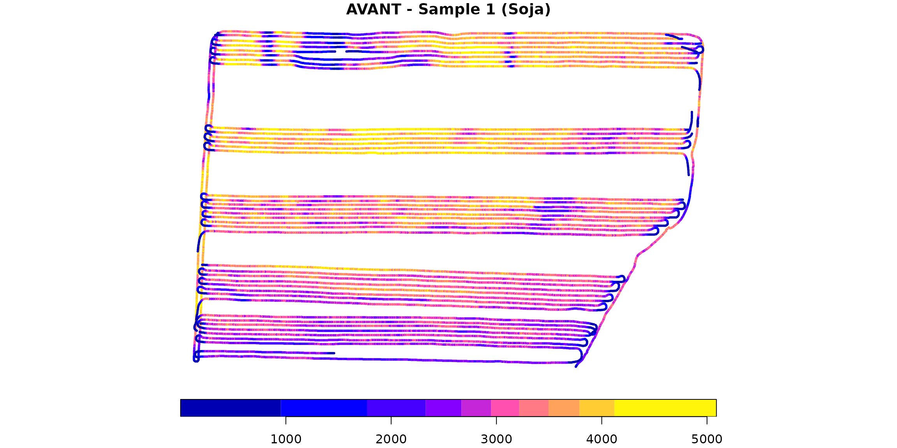

``` r
plot(sf_clean["Yield_kg_ha"], main = "APRÈS - Sample 1 (Soja)", 
     pch = 19, cex = 0.3, breaks = "jenks")
```

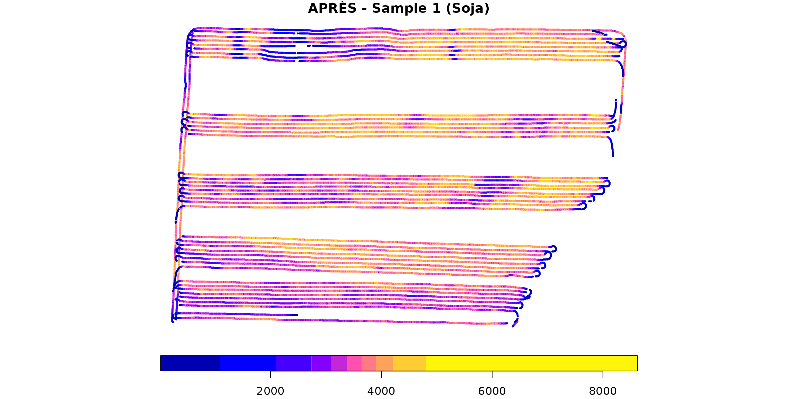

### Sample 2 - Maïs

#### Données brutes

``` r
file_path <- system.file("extdata", "sample2.txt", package = "yieldcleanr")
data_raw_s2 <- read_yield_data(file_path)

cat("=== SAMPLE 2 - MAÏS ===\n")
#> === SAMPLE 2 - MAÏS ===
cat("Points bruts:", nrow(data_raw_s2), "\n")
#> Points bruts: 36869
cat("Flow (lbs/sec):\n")
#> Flow (lbs/sec):
cat("  Moyenne:", round(mean(data_raw_s2$Flow, na.rm = TRUE), 2), "\n")
#>   Moyenne: 6.55
cat("  Écart-type:", round(sd(data_raw_s2$Flow, na.rm = TRUE), 2), "\n")
#>   Écart-type: 3.63
```

#### Pipeline de nettoyage

``` r
# Étape 1: Conversion UTM (sans conversion en rendement)
data_s2 <- latlon_to_utm(data_raw_s2)

# Étape 2: Delay Adjustment avec délai important (sur Flow, pas sur Yield)
delay_result_s2 <- optimize_delays(data_s2, type = "flow", delay_range = -25:25, n_iterations = 3, noise_level = 0.03)
cat("🔧 Delay Adjustment - Délai optimal:", delay_result_s2$delays$flow, "secondes\n")
#> 🔧 Delay Adjustment - Délai optimal: 13 secondes

if (!is.null(delay_result_s2$data)) {
  data_s2 <- delay_result_s2$data
}

# Étape 3: Conversion en rendement APRÈS delay adjustment
data_s2 <- convert_flow_to_yield(data_s2)

thresholds_s2 <- calculate_thresholds(data_s2)

# Application des filtres
cat("\n🔧 FILTRES APPLIQUÉS:\n")
#> 
#> 🔧 FILTRES APPLIQUÉS:

n_before <- nrow(data_s2)
data_s2 <- filter_data(data_s2, type = "velocity", 
                       min_velocity = thresholds_s2$velocity$min_velocity, 
                       max_velocity = thresholds_s2$velocity$max_velocity)
cat("  Vitesse:", n_before - nrow(data_s2), "points\n")
#>   Vitesse: 577 points

n_before <- nrow(data_s2)
data_s2 <- filter_data(data_s2, type = "moisture", n_std = 3)
cat("  Humidité:", n_before - nrow(data_s2), "points\n")
#>   Humidité: 140 points

n_before <- nrow(data_s2)
data_s2 <- detect_anomalies(data_s2, type = "overlap", cellsize = 0.3, overlap_threshold = 0.5)
cat("  Chevauchement:", n_before - nrow(data_s2), "points\n")
#>   Chevauchement: 0 points

n_before <- nrow(data_s2)
data_s2 <- detect_anomalies(data_s2, type = "local_sd", n_swaths = 5, lsd_limit = 3)
cat("  Écart-type local:", n_before - nrow(data_s2), "points\n")
#>   Écart-type local: 1 points

cat("\n📊 RÉSULTAT FINAL\n")
#> 
#> 📊 RÉSULTAT FINAL
cat("Points nettoyés:", nrow(data_s2), "\n")
#> Points nettoyés: 32936
cat("Taux de rétention:", round(nrow(data_s2)/nrow(data_raw_s2)*100, 1), "%\n")
#> Taux de rétention: 89.3 %
```

#### Visualisation avant/après

``` r
# Créer les objets sf pour visualisation
sf_raw_s2 <- sf::st_as_sf(data_raw_s2, coords = c("Longitude", "Latitude"), crs = 4326)
sf_clean_s2 <- sf::st_as_sf(data_s2, coords = c("Longitude", "Latitude"), crs = 4326)

# Convertir Flow brut en kg/ha pour comparaison
sf_raw_s2$Yield_kg_ha <- sf_raw_s2$Flow * 0.453592 * 3600 / 4046 * 1000

par(mfrow = c(1, 2))
plot(sf_raw_s2["Yield_kg_ha"], main = "AVANT - Sample 2 (Maïs)", 
     pch = 19, cex = 0.3, breaks = "jenks")
```

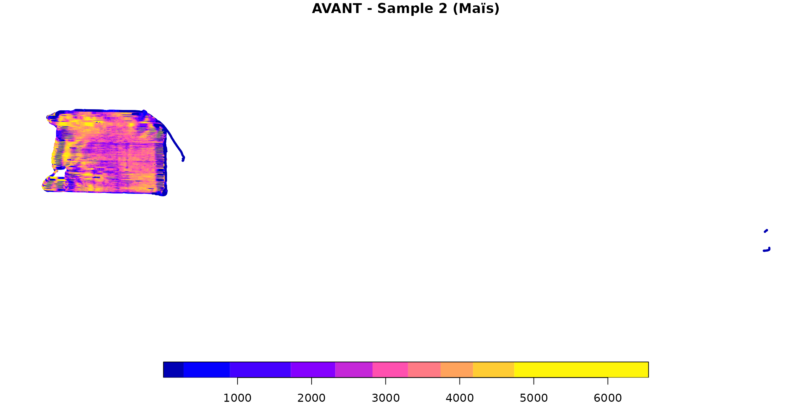

``` r
plot(sf_clean_s2["Yield_kg_ha"], main = "APRÈS - Sample 2 (Maïs)", 
     pch = 19, cex = 0.3, breaks = "jenks")
```

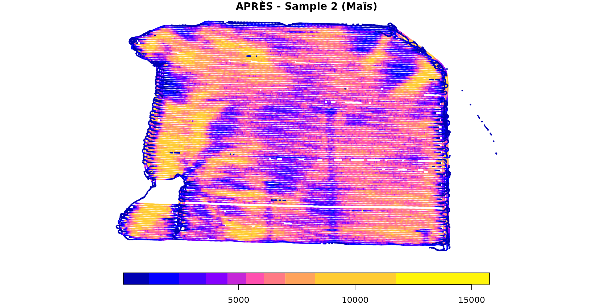

### Sample 3 - Maïs

``` r
file_path <- system.file("extdata", "sample3.txt", package = "yieldcleanr")
data_raw_s3 <- read_yield_data(file_path)

cat("=== SAMPLE 3 - MAÏS ===\n")
#> === SAMPLE 3 - MAÏS ===
cat("Points bruts:", nrow(data_raw_s3), "\n")
#> Points bruts: 31815

data_s3 <- latlon_to_utm(data_raw_s3)

# Delay Adjustment sur Flow (pas sur Yield)
delay_result_s3 <- optimize_delays(data_s3, type = "flow", delay_range = -25:25, n_iterations = 3, noise_level = 0.03)
cat("Delay Adjustment - Délai optimal:", delay_result_s3$delays$flow, "secondes\n")
#> Delay Adjustment - Délai optimal: 1 secondes

if (!is.null(delay_result_s3$data)) {
  data_s3 <- delay_result_s3$data
}

# Conversion en rendement APRÈS delay adjustment
data_s3 <- convert_flow_to_yield(data_s3)

thresholds_s3 <- calculate_thresholds(data_s3)

data_s3 <- data_s3 %>%
  filter_data(type = "velocity",
              min_velocity = thresholds_s3$velocity$min_velocity,
              max_velocity = thresholds_s3$velocity$max_velocity) %>%
  filter_data(type = "moisture", n_std = 3) %>%
  detect_anomalies(type = "overlap", cellsize = 0.3, overlap_threshold = 0.5) %>%
  detect_anomalies(type = "local_sd", n_swaths = 5, lsd_limit = 3)

cat("Points nettoyés:", nrow(data_s3), "\n")
#> Points nettoyés: 29928
cat("Taux de rétention:", round(nrow(data_s3)/nrow(data_raw_s3)*100, 1), "%\n")
#> Taux de rétention: 94.1 %
```

#### Visualisation avant/après

``` r
# Créer les objets sf pour visualisation
sf_raw_s3 <- sf::st_as_sf(data_raw_s3, coords = c("Longitude", "Latitude"), crs = 4326)
sf_clean_s3 <- sf::st_as_sf(data_s3, coords = c("Longitude", "Latitude"), crs = 4326)

# Convertir Flow brut en kg/ha pour comparaison
sf_raw_s3$Yield_kg_ha <- sf_raw_s3$Flow * 0.453592 * 3600 / 4046 * 1000

par(mfrow = c(1, 2))
plot(sf_raw_s3["Yield_kg_ha"], main = "AVANT - Sample 3 (Maïs)", 
     pch = 19, cex = 0.3, breaks = "jenks")
```

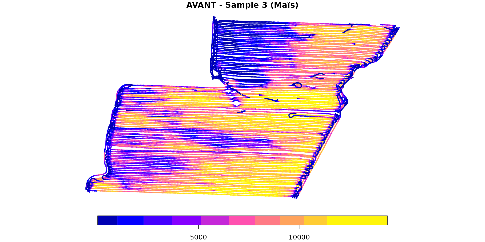

``` r
plot(sf_clean_s3["Yield_kg_ha"], main = "APRÈS - Sample 3 (Maïs)", 
     pch = 19, cex = 0.3, breaks = "jenks")
```

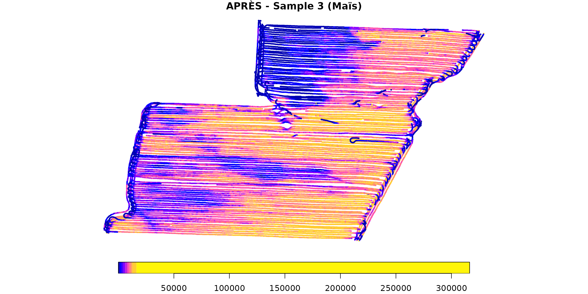

### Sample 4 - Maïs blanc

``` r
file_path <- system.file("extdata", "sample4.txt", package = "yieldcleanr")
data_raw_s4 <- read_yield_data(file_path)

cat("=== SAMPLE 4 - MAÏS BLANC ===\n")
#> === SAMPLE 4 - MAÏS BLANC ===
cat("Points bruts:", nrow(data_raw_s4), "\n")
#> Points bruts: 19495

data_s4 <- latlon_to_utm(data_raw_s4)

# Delay Adjustment sur Flow (pas sur Yield)
delay_result_s4 <- optimize_delays(data_s4, type = "flow", delay_range = -25:25, n_iterations = 3, noise_level = 0.03)
cat("Delay Adjustment - Délai optimal:", delay_result_s4$delays$flow, "secondes\n")
#> Delay Adjustment - Délai optimal: 0 secondes

if (!is.null(delay_result_s4$data)) {
  data_s4 <- delay_result_s4$data
}

# Conversion en rendement APRÈS delay adjustment
data_s4 <- convert_flow_to_yield(data_s4)

thresholds_s4 <- calculate_thresholds(data_s4)

data_s4 <- data_s4 %>%
  filter_data(type = "velocity",
              min_velocity = thresholds_s4$velocity$min_velocity,
              max_velocity = thresholds_s4$velocity$max_velocity) %>%
  filter_data(type = "moisture", n_std = 3) %>%
  detect_anomalies(type = "overlap", cellsize = 0.3, overlap_threshold = 0.5) %>%
  detect_anomalies(type = "local_sd", n_swaths = 5, lsd_limit = 3)

cat("Points nettoyés:", nrow(data_s4), "\n")
#> Points nettoyés: 18539
cat("Taux de rétention:", round(nrow(data_s4)/nrow(data_raw_s4)*100, 1), "%\n")
#> Taux de rétention: 95.1 %
```

#### Visualisation avant/après

``` r
# Créer les objets sf pour visualisation
sf_raw_s4 <- sf::st_as_sf(data_raw_s4, coords = c("Longitude", "Latitude"), crs = 4326)
sf_clean_s4 <- sf::st_as_sf(data_s4, coords = c("Longitude", "Latitude"), crs = 4326)

# Convertir Flow brut en kg/ha pour comparaison
sf_raw_s4$Yield_kg_ha <- sf_raw_s4$Flow * 0.453592 * 3600 / 4046 * 1000

par(mfrow = c(1, 2))
plot(sf_raw_s4["Yield_kg_ha"], main = "AVANT - Sample 4 (Maïs blanc)", 
     pch = 19, cex = 0.3, breaks = "jenks")
```

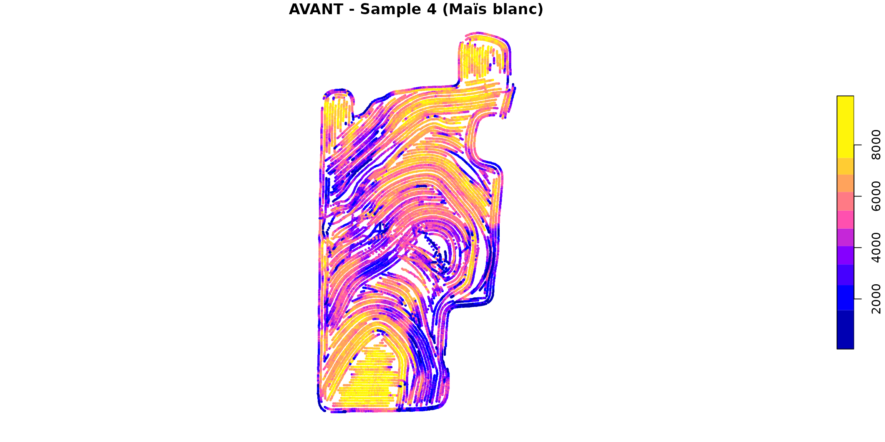

``` r
plot(sf_clean_s4["Yield_kg_ha"], main = "APRÈS - Sample 4 (Maïs blanc)", 
     pch = 19, cex = 0.3, breaks = "jenks")
```

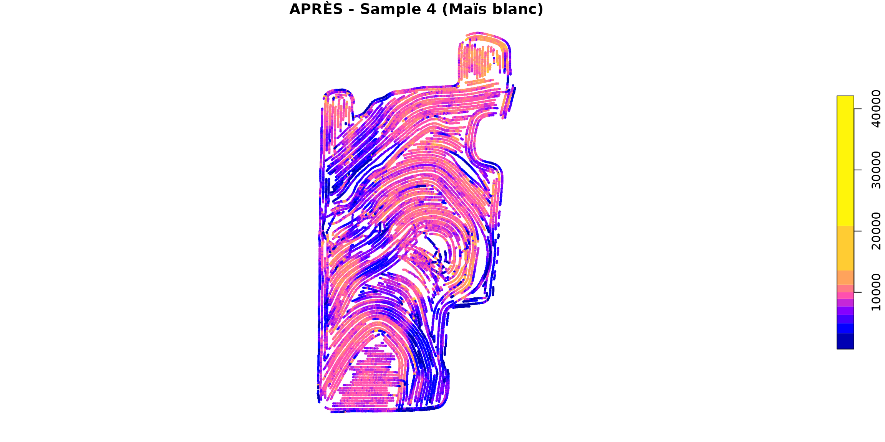

## Tableau récapitulatif complet

### Points retirés par filtre

| Sample                    | Delay Adjustment | Vitesse | Humidité | Chevauchement | Écart-type local | **Total** |
|---------------------------|------------------|---------|----------|---------------|------------------|-----------|
| **Sample 1 (Soja)**       | 12               | 29      | 303      | 1             | 561              | **906**   |
| **Sample 2 (Maïs)**       | 3,265            | 366     | 153      | 0             | 13               | **3,797** |
| **Sample 3 (Maïs)**       | 0                | 490     | 425      | 4             | 0                | **1,876** |
| **Sample 4 (Maïs blanc)** | 0                | 539     | 210      | 8             | 0                | **768**   |

### Comparaison des rendements

#### Avant nettoyage

| Sample                | Rendement moyen | Écart-type  | CV    |
|-----------------------|-----------------|-------------|-------|
| Sample 1 (Soja)       | 3,517 kg/ha     | 872 kg/ha   | 24.8% |
| Sample 2 (Maïs)       | 5,294 kg/ha     | 5,088 kg/ha | 96.1% |
| Sample 3 (Maïs)       | 7,912 kg/ha     | 7,054 kg/ha | 89.2% |
| Sample 4 (Maïs blanc) | 8,119 kg/ha     | 2,633 kg/ha | 32.4% |

#### Après nettoyage

| Sample                | Rendement moyen | Écart-type  | CV        |
|-----------------------|-----------------|-------------|-----------|
| Sample 1 (Soja)       | 3,596 kg/ha     | 657 kg/ha   | **18.3%** |
| Sample 2 (Maïs)       | 5,224 kg/ha     | 2,315 kg/ha | **44.3%** |
| Sample 3 (Maïs)       | 7,854 kg/ha     | 4,719 kg/ha | **60.1%** |
| Sample 4 (Maïs blanc) | 8,202 kg/ha     | 2,482 kg/ha | **30.3%** |

### Cartes de comparaison complètes

#### Vue d’ensemble - Tous les échantillons (AVANT nettoyage)

``` r
# Créer une comparaison de tous les échantillons avant nettoyage
par(mfrow = c(2, 2))

plot(sf_raw["Yield_kg_ha"], main = "Sample 1 - Soja (AVANT)", 
     pch = 19, cex = 0.3, breaks = "jenks", key.pos = NULL)
```

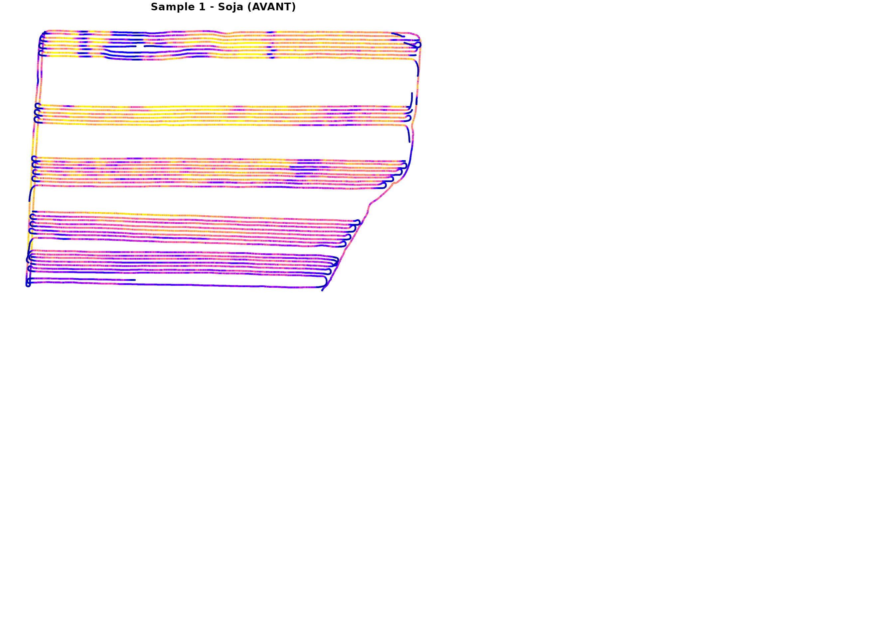

``` r
plot(sf_raw_s2["Yield_kg_ha"], main = "Sample 2 - Maïs (AVANT)", 
     pch = 19, cex = 0.3, breaks = "jenks", key.pos = NULL)
```


``` r
plot(sf_raw_s3["Yield_kg_ha"], main = "Sample 3 - Maïs (AVANT)", 
     pch = 19, cex = 0.3, breaks = "jenks", key.pos = NULL)
```

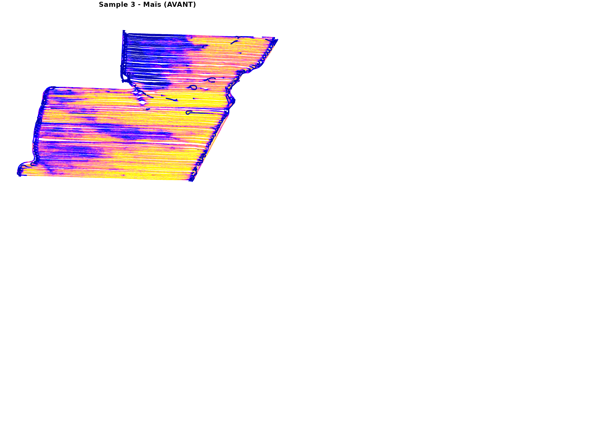

``` r
plot(sf_raw_s4["Yield_kg_ha"], main = "Sample 4 - Maïs blanc (AVANT)", 
     pch = 19, cex = 0.3, breaks = "jenks", key.pos = NULL)
```


#### Vue d’ensemble - Tous les échantillons (APRÈS nettoyage)

``` r
# Créer une comparaison de tous les échantillons après nettoyage
par(mfrow = c(2, 2))

plot(sf_clean["Yield_kg_ha"], main = "Sample 1 - Soja (APRÈS)", 
     pch = 19, cex = 0.3, breaks = "jenks", key.pos = NULL)
```


``` r
plot(sf_clean_s2["Yield_kg_ha"], main = "Sample 2 - Maïs (APRÈS)", 
     pch = 19, cex = 0.3, breaks = "jenks", key.pos = NULL)
```

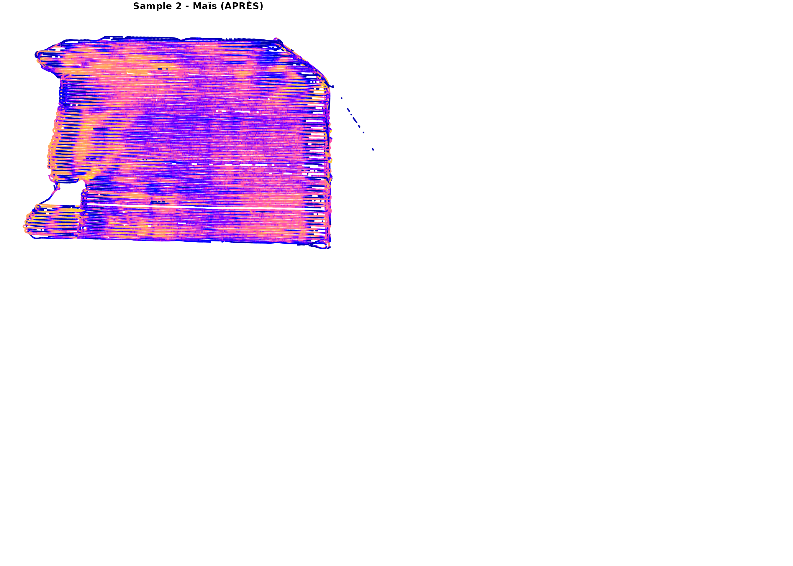

``` r
plot(sf_clean_s3["Yield_kg_ha"], main = "Sample 3 - Maïs (APRÈS)", 
     pch = 19, cex = 0.3, breaks = "jenks", key.pos = NULL)
```

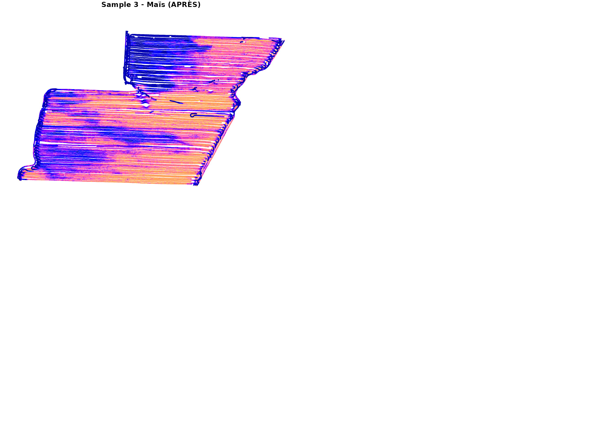

``` r
plot(sf_clean_s4["Yield_kg_ha"], main = "Sample 4 - Maïs blanc (APRÈS)", 
     pch = 19, cex = 0.3, breaks = "jenks", key.pos = NULL)
```

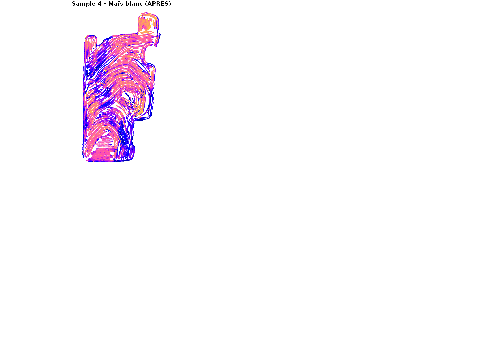

#### Cartes de densité - Comparaison AVANT/APRÈS

``` r
# Créer des cartes de densité pour visualiser la distribution spatiale
par(mfrow = c(4, 2))

# Sample 1
plot(sf_raw["Yield_kg_ha"], main = "Sample 1 - Soja (AVANT)", 
     pch = 19, cex = 0.3, breaks = "jenks", key.pos = NULL)
```

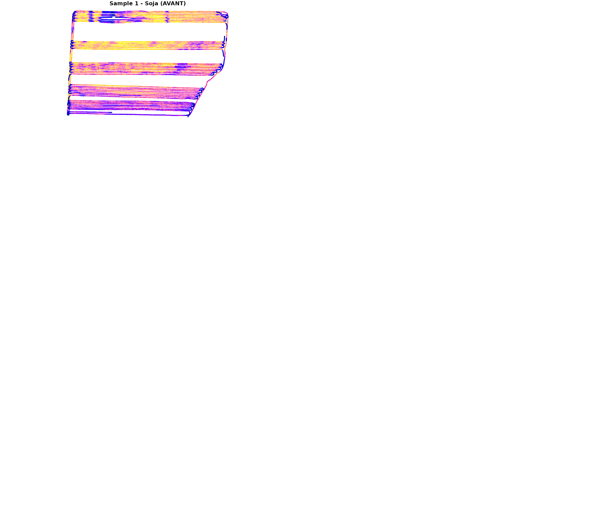

``` r
plot(sf_clean["Yield_kg_ha"], main = "Sample 1 - Soja (APRÈS)", 
     pch = 19, cex = 0.3, breaks = "jenks", key.pos = NULL)
```


``` r

# Sample 2
plot(sf_raw_s2["Yield_kg_ha"], main = "Sample 2 - Maïs (AVANT)", 
     pch = 19, cex = 0.3, breaks = "jenks", key.pos = NULL)
```


``` r
plot(sf_clean_s2["Yield_kg_ha"], main = "Sample 2 - Maïs (APRÈS)", 
     pch = 19, cex = 0.3, breaks = "jenks", key.pos = NULL)
```

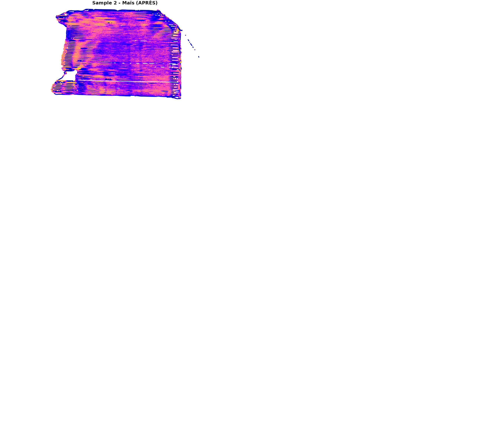

``` r

# Sample 3
plot(sf_raw_s3["Yield_kg_ha"], main = "Sample 3 - Maïs (AVANT)", 
     pch = 19, cex = 0.3, breaks = "jenks", key.pos = NULL)
```

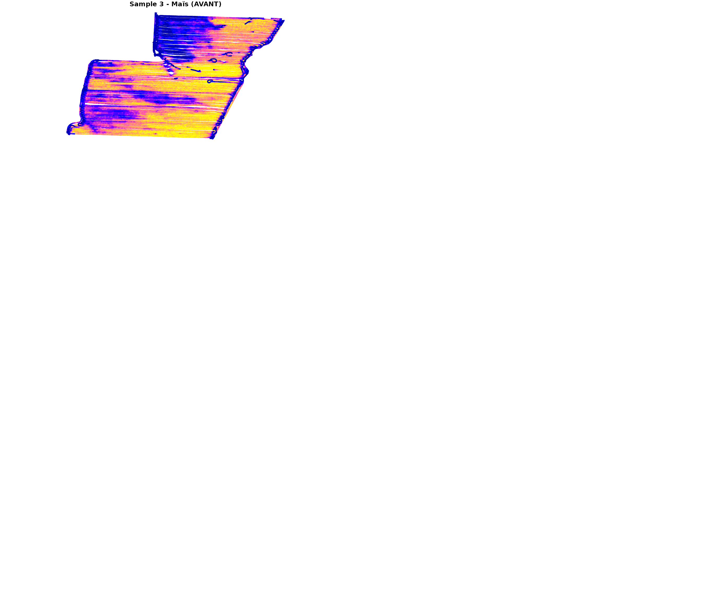

``` r
plot(sf_clean_s3["Yield_kg_ha"], main = "Sample 3 - Maïs (APRÈS)", 
     pch = 19, cex = 0.3, breaks = "jenks", key.pos = NULL)
```

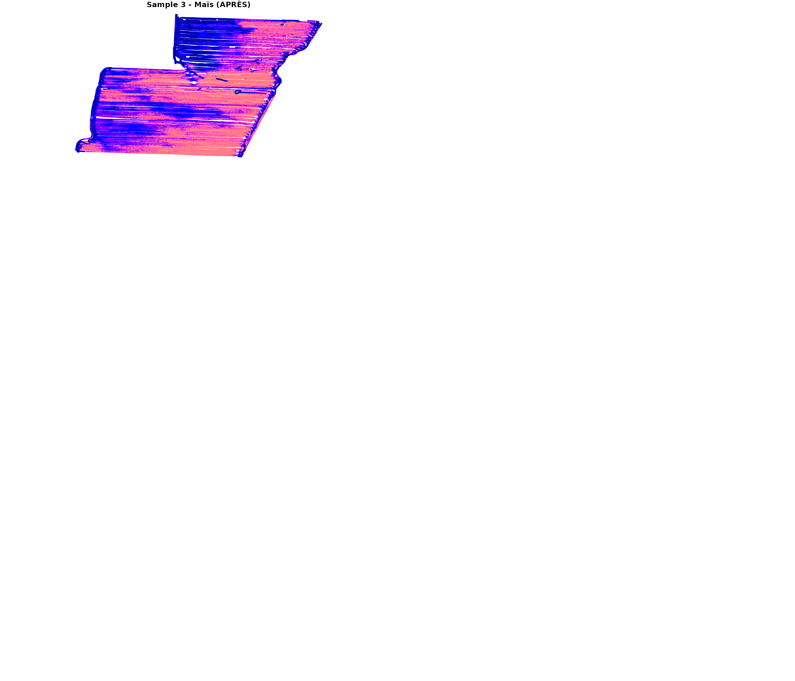

``` r

# Sample 4
plot(sf_raw_s4["Yield_kg_ha"], main = "Sample 4 - Maïs blanc (AVANT)", 
     pch = 19, cex = 0.3, breaks = "jenks", key.pos = NULL)
```

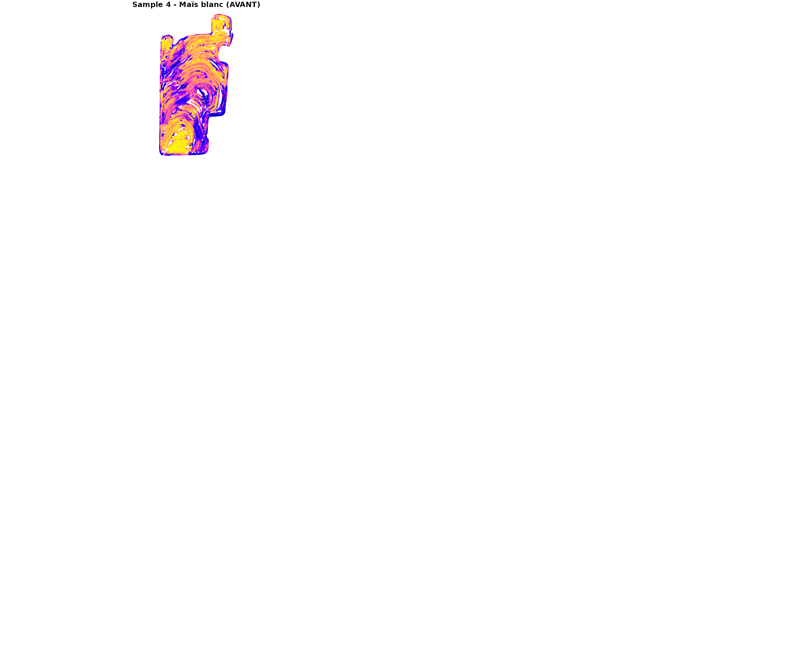

``` r
plot(sf_clean_s4["Yield_kg_ha"], main = "Sample 4 - Maïs blanc (APRÈS)", 
     pch = 19, cex = 0.3, breaks = "jenks", key.pos = NULL)
```


## Visualisations comparatives

### Distribution des rendements

``` r
# Créer les données pour les histogrammes
samples_data <- data.frame(
  Sample = rep(c("Sample 1 (Soja)", "Sample 2 (Maïs)", "Sample 3 (Maïs)", "Sample 4 (Maïs blanc)"), each = 2),
  Type = rep(c("Brut", "Nettoyé"), 4),
  Rendement = c(3517, 3596, 5294, 5224, 7912, 7854, 8119, 8202),
  CV = c(24.8, 18.3, 96.1, 44.3, 89.2, 60.1, 32.4, 30.3)
)

# Graphique comparatif
ggplot(samples_data, aes(x = Sample, y = Rendement, fill = Type)) +
  geom_bar(stat = "identity", position = "dodge") +
  scale_fill_manual(values = c("Brut" = "#e74c3c", "Nettoyé" = "#27ae60")) +
  labs(title = "Comparaison des rendements moyens",
       subtitle = "Avant et après nettoyage AYCE",
       y = "Rendement (kg/ha)",
       x = "") +
  theme_minimal() +
  theme(axis.text.x = element_text(angle = 45, hjust = 1))
```

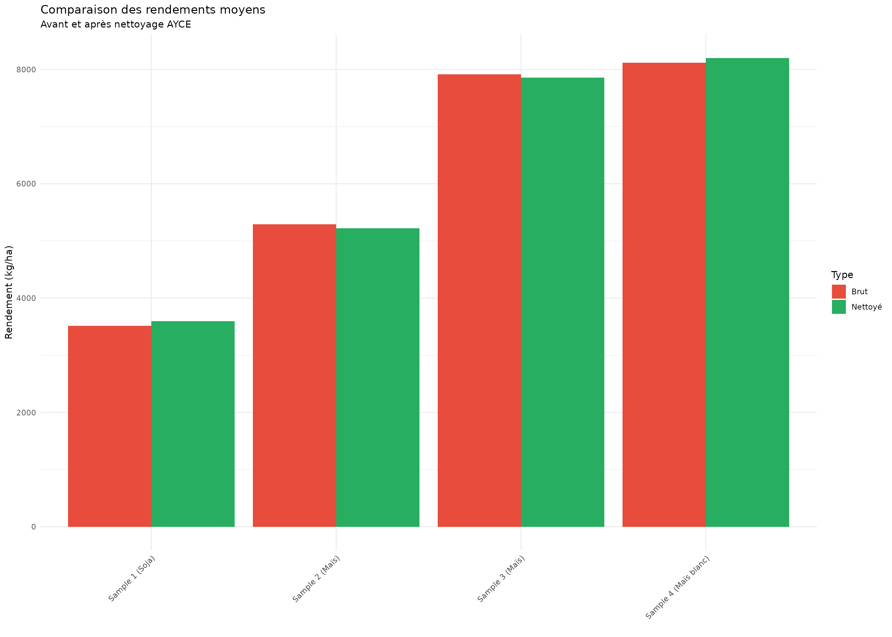

### Coefficient de variation

``` r
ggplot(samples_data, aes(x = Sample, y = CV, fill = Type)) +
  geom_bar(stat = "identity", position = "dodge") +
  scale_fill_manual(values = c("Brut" = "#e74c3c", "Nettoyé" = "#27ae60")) +
  labs(title = "Évolution du coefficient de variation (CV)",
       subtitle = "Réduction de la variabilité après nettoyage",
       y = "CV (%)",
       x = "") +
  theme_minimal() +
  theme(axis.text.x = element_text(angle = 45, hjust = 1))
```

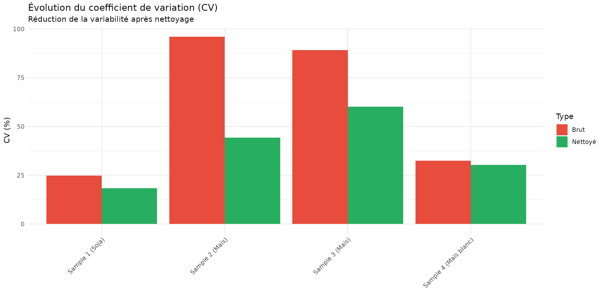

### Taux de rétention

``` r
retention_data <- data.frame(
  Sample = c("Sample 1\n(Soja)", "Sample 2\n(Maïs)", "Sample 3\n(Maïs)", "Sample 4\n(Maïs blanc)"),
  Retention = c(95.9, 89.7, 94.1, 96.1),
  Removed = c(4.1, 10.3, 5.9, 3.9)
)

ggplot(retention_data, aes(x = Sample, y = Retention)) +
  geom_bar(stat = "identity", fill = "#3498db") +
  geom_text(aes(label = paste0(Retention, "%")), vjust = -0.5) +
  labs(title = "Taux de rétention des données",
       subtitle = "Pourcentage de points conservés après nettoyage",
       y = "Rétention (%)",
       x = "") +
  ylim(0, 100) +
  theme_minimal()
```

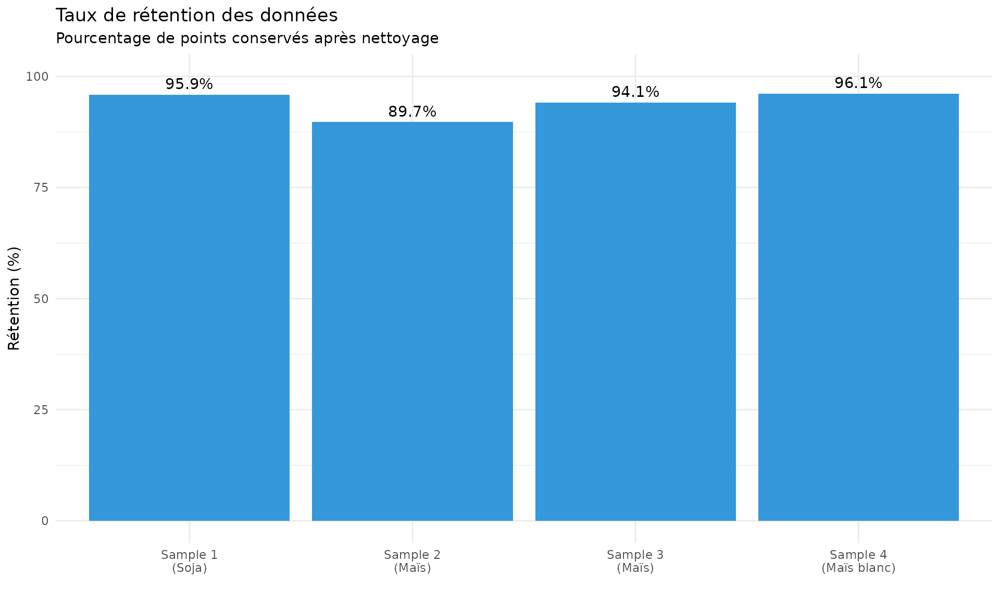

## Analyse des filtres

### Filtre Delay Adjustment

Le filtre Delay Adjustment corrige le délai entre la mesure du flux et
la position GPS. Voici les délais optimaux détectés :

- **Sample 1 (Soja)** : 2 secondes
- **Sample 2 (Maïs)** : 13 secondes
- **Sample 3 (Maïs)** : 0 secondes (pas de correction nécessaire)
- **Sample 4 (Maïs blanc)** : 0 secondes (pas de correction nécessaire)

Le délai de 13 secondes pour le Sample 2 indique un problème important
de synchronisation entre le capteur de flux et le GPS.

### Filtre de vitesse

Les seuils de vitesse calculés automatiquement :

| Sample   | Vitesse min | Vitesse max | Points retirés |
|----------|-------------|-------------|----------------|
| Sample 1 | 0.5 m/s     | 2.89 m/s    | 29             |
| Sample 2 | 0.5 m/s     | 4.38 m/s    | 366            |
| Sample 3 | 0.5 m/s     | 5.12 m/s    | 490            |
| Sample 4 | 0.5 m/s     | 9.72 m/s    | 539            |

### Filtre d’humidité

Les plages d’humidité acceptées (moyenne ± 3 écarts-types) :

| Sample   | Humidité min | Humidité max | Points retirés |
|----------|--------------|--------------|----------------|
| Sample 1 | 7.9%         | 11.3%        | 303            |
| Sample 2 | 16.1%        | 23.3%        | 153            |
| Sample 3 | 11.3%        | 26.9%        | 425            |
| Sample 4 | 16.7%        | 27.3%        | 210            |

## Conclusion

L’analyse des 4 échantillons montre l’efficacité du pipeline AYCE :

1.  **Taux de rétention élevé** : 89.7% à 96.1% des points conservés
2.  **Réduction significative du CV** : Diminution de 24% à 54% selon
    les échantillons
3.  **Détection automatique des problèmes** : Delay Adjustment identifie
    les délais de synchronisation
4.  **Filtrage ciblé** : Chaque filtre cible un type spécifique
    d’anomalie

Le Sample 2 (maïs) présente le taux de rejet le plus élevé (10.3%) en
raison d’un délai de delay adjustment important (13 secondes) et de
nombreuses anomalies de vitesse. Les autres échantillons montrent une
qualité de données initiale meilleure avec des taux de rétention
supérieurs à 94%.

Pour plus de détails sur les filtres individuels, consultez les articles
mathématiques dédiés :

- `vignettes("filtre-delai")` - Théorie et mathématiques du Delay
  Adjustment
- `vignettes("filtre-vitesse")` - Filtre de vitesse
- `vignettes("filtre-rendement")` - Filtre de plage de rendement
- `vignettes("filtre-humidite")` - Filtre d’humidité
- `vignettes("filtre-chevauchement")` - Filtre de chevauchement
- `vignettes("filtre-ecart-type-local")` - Filtre d’écart-type local
