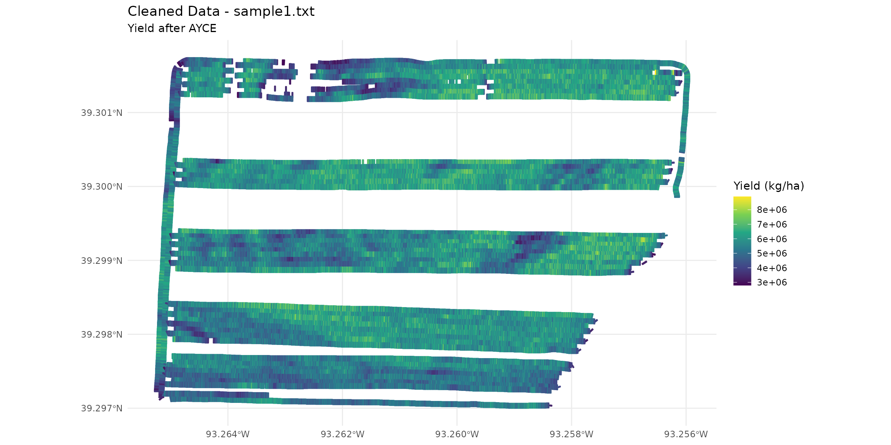
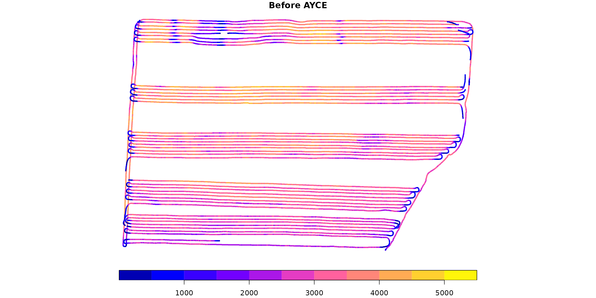
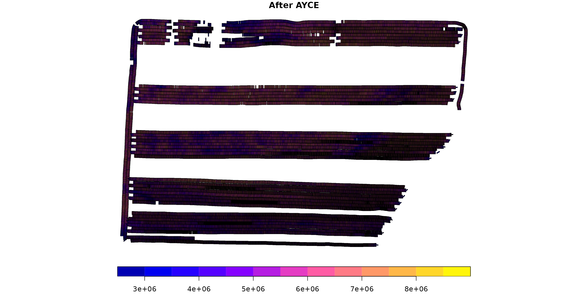

# sample1.txt - Soybean Data

## Introduction

This file contains yield data for soybeans collected by a combine
harvester.

## Loading Data

``` r
library(yieldcleanr)
library(ggplot2)
library(sf)
```

    ## Linking to GEOS 3.12.1, GDAL 3.8.4, PROJ 9.4.0; sf_use_s2() is TRUE

## Raw Data

``` r
file_path <- system.file("extdata", "sample1.txt", package = "yieldcleanr")
data_raw <- read_yield_data(file_path)
```

    ## Distance detectee en pouces (moyenne: 53.6 ) - conversion en metres
    ## Swath detecte en pouces (moyenne: 288 ) - conversion en metres

``` r
nrow(data_raw)
```

    ## [1] 21917

``` r
mean(data_raw$Flow, na.rm = TRUE)
```

    ## [1] 7.644675

## Raw Data Map

``` r
data_raw_sf <- sf::st_as_sf(data_raw, coords = c("Longitude", "Latitude"), crs = 4326)

ggplot() +
  geom_sf(data = data_raw_sf, aes(color = Flow), size = 0.5, alpha = 0.7) +
  scale_color_viridis_c(name = "Flow (lbs/s)") +
  theme_minimal() +
  labs(title = "Raw Data - sample1.txt", subtitle = "Flow before cleaning")
```


## AYCE Cleaning

``` r
cleaned <- clean_yield(
  file_path = file_path,
  metrique = TRUE,
  polygon = TRUE
)
```

    ## ================================================
    ##    Yield Data Cleaning Pipeline               
    ##    Output: Metric (kg/ha)                      
    ##    Geometry: Polygons                          
    ## ================================================
    ## 
    ## Etape 1 : chargement des donnees...
    ## Distance detectee en pouces (moyenne: 53.6 ) - conversion en metres
    ## Swath detecte en pouces (moyenne: 288 ) - conversion en metres
    ##   - 21917 raw observations loaded
    ## Etape 2 : conversion en coordonnees UTM...
    ## Zone UTM detectee: 15
    ## Etape 3 : PCDI - optimisation du delai de flux...
    ## === PCDI: Phase Correlation Delay Identification ( Flow ) ===
    ## Delai optimal ( Flow ): -4 secondes
    ## RSC a l'optimal : 0.2965
    ## Stabilite (CV) : 0.0016
    ##   Delai optimal flux: -4 secondes
    ## Etape 3b : PCDI - optimisation du delai d'humidite...
    ## === PCDI: Phase Correlation Delay Identification ( Moisture ) ===
    ## Delai optimal ( Moisture ): -18 secondes
    ## RSC a l'optimal : 0.282
    ## Stabilite (CV) : 0.0012
    ##   Delai optimal humidite: -18 secondes
    ## Etape 3c : calcul du rendement initial pour les seuils...
    ## Yield calcule: 81059 bu/acre (lbs/bu = 60 )
    ## Etape 4 : calcul des seuils automatiques...
    ## === Automatic Threshold Calculation (AYCE) ===
    ## Yield: Yield_buacre MIN = 24702.3 MAX = 137334.83
    ## Velocity: MIN = 0.5 MAX = 2.52
    ## Position: X[ 477042 - 477999 ]
    ## Position: Y[ 4349680 - 4350386 ]
    ## Etape 5 : filtre header...
    ##   Rows: 21120
    ## Etape 6 : filtre GPS...
    ##   Rows: 21120
    ## Etape 7 : calcul de la vitesse...
    ## Etape 8 : filtre vitesse...
    ##   Rows: 21045
    ## Etape 9 : correction du delai de flux ( -4 s)...
    ## Flow delay correction: 4 seconds, 4 points elimines (valeurs NA)
    ##   Rows: 21041
    ## Etape 9a : correction du delai d'humidite ( -18 s)...
    ## Moisture delay correction: 18 seconds, 18 points elimines (valeurs NA)
    ##   Rows: 21023
    ## Etape 9b : calcul du rendement apres delai...
    ## Yield calcule: 82966.9 bu/acre (lbs/bu = 60 )
    ## Etape 9c : recalcul des seuils apres delai...
    ## === Automatic Threshold Calculation (AYCE) ===
    ## Yield: Yield_buacre MIN = 33063.29 MAX = 132900.05
    ## Velocity: MIN = 0.5 MAX = 2.37
    ## Position: X[ 477047 - 477990 ]
    ## Position: Y[ 4349680 - 4350386 ]
    ## Etape 9d : validation de Pass via analyse de direction...
    ##   Pass column has 65 unique values
    ##   Pass column appears reasonable, using as-is
    ## Etape 9e : suppression des points de bordure lies au delai...
    ##    319 boundary points removed ( end , delay: -4 s = 5 points)
    ## Etape 10 : suppression des rendements nuls...
    ##   Rows: 20704
    ## Etape 11 : filtre plage de rendement...
    ## Yield range filter: 100 points elimines (rendement hors plage: 33063.3 - 132900.1 )
    ##   Rows: 20604
    ## Etape 12 : filtre humidite (auto-detection)...
    ## Moisture auto-range: 8 - 11.3 (mean +/- 3 SD = 9.6 +/- 0.6 )
    ## Moisture range filter: 297 points elimines (humidite hors plage: 8 - 11.3 )
    ##   Rows: 20307
    ## Etape 13 : filtre de chevauchement bitmap...
    ## === Bitmap Overlap Filter ===
    ## Donnees etendues - utilisation du bitmap sparse
    ## Overlap ratio: min 0 max 0
    ## Overlap filter: 0 points elimines (0%)
    ##   Rows: 20307
    ## Etape 14 : filtre ecart-type localise...
    ## === Localized SD Filter ===
    ## Local SD filter: 329 points elimines (1.6%)
    ##   Rows: 19978
    ## Etape 15 : validation et controle qualite...
    ## === AYCE Validation & Quality Control ===
    ## Retention rate: 91.2 %
    ## Raw CV: 24.9 %
    ## Clean CV: 16.9 %
    ##   Retention rate: 91.2 %
    ## Etape 16 : formatage de la sortie...
    ## Etape 16b : calcul du cap...
    ## Etape 16b.1 : lissage du cap par segments...
    ## Etape 16c : creation de l'objet SF polygones...
    ## Creation d'un objet SF avec polygones...
    ## Creation des geometries des polygones...
    ## Objet SF cree : 19978 polygones
    ## 
    ## ================================================
    ## Termine : 19978 observations nettoyees
    ## Rendement moyen : 5689068 kg/ha
    ## ================================================

## Cleaned Data Map

``` r
ggplot() +
  geom_sf(data = cleaned, aes(color = Yield), size = 0.5, alpha = 0.7) +
  scale_color_viridis_c(name = "Yield (kg/ha)") +
  theme_minimal() +
  labs(title = "Cleaned Data - sample1.txt", subtitle = "Yield after AYCE")
```



## Before/After Comparison

``` r
par(mfrow = c(1, 2))

# Before
data_raw_sf$Yield_kg_ha <- data_raw_sf$Flow * 0.453592 * 3600 / 4046 * 1000
plot(data_raw_sf["Yield_kg_ha"], main = "Before AYCE", pch = 19, cex = 0.3)
```



``` r
# After
plot(cleaned["Yield"], main = "After AYCE", pch = 19, cex = 0.3)
```



## Statistics

``` r
cat("Raw data:\n")
```

    ## Raw data:

``` r
cat("  Rows:", nrow(data_raw), "\n")
```

    ##   Rows: 21917

``` r
cat("  Mean flow:", round(mean(data_raw$Flow, na.rm = TRUE), 2), "lbs/s\n")
```

    ##   Mean flow: 7.64 lbs/s

``` r
cat("\nCleaned data:\n")
```

    ## 
    ## Cleaned data:

``` r
cat("  Rows:", nrow(cleaned), "\n")
```

    ##   Rows: 19978

``` r
cat("  Mean yield:", round(mean(cleaned$Yield, na.rm = TRUE), 1), "kg/ha\n")
```

    ##   Mean yield: 5689068 kg/ha
