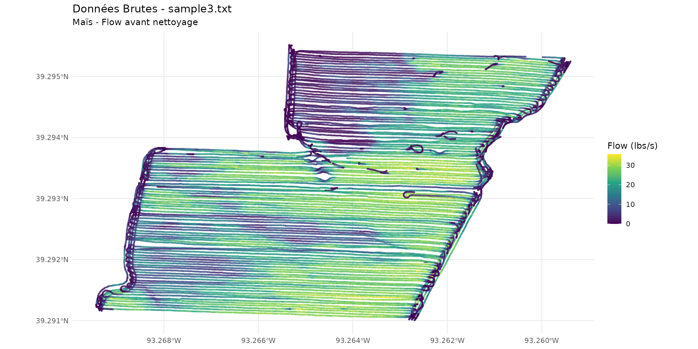
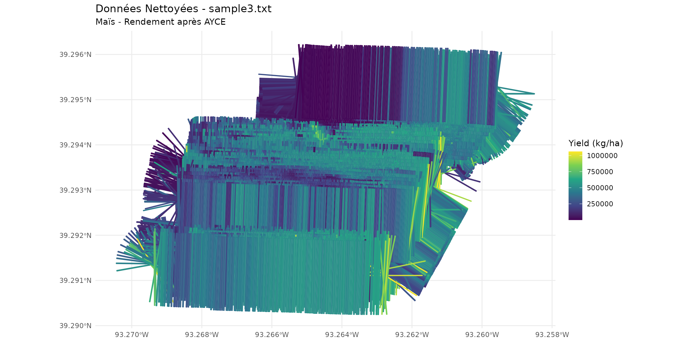

# sample3.txt - Données de Maïs

## Introduction

Ce fichier contient des données de rendement de maïs collectées par une
moissonneuse-batteuse. Les données présentent des valeurs Flow = 0 au
début (phase de ramp-up).

## Chargement des Données

``` r
library(yieldcleanr)
library(ggplot2)
library(sf)
```

    ## Linking to GEOS 3.12.1, GDAL 3.8.4, PROJ 9.4.0; sf_use_s2() is TRUE

## Données Brutes

``` r
file_path <- system.file("extdata", "sample3.txt", package = "yieldcleanr")
data_raw <- read_yield_data(file_path)
```

    ## Distance detectee en pouces (moyenne: 79.2 ) - conversion en metres

``` r
cat("Données brutes:\n")
```

    ## Données brutes:

``` r
cat("  Lignes:", nrow(data_raw), "\n")
```

    ##   Lignes: 31815

``` r
cat("  Flow moyen:", round(mean(data_raw$Flow, na.rm = TRUE), 2), "lbs/s\n")
```

    ##   Flow moyen: 15.96 lbs/s

``` r
cat("  Grain type:", unique(data_raw$GrainType), "\n")
```

    ##   Grain type: Corn

``` r
cat("  Points avec Flow = 0:", sum(data_raw$Flow == 0, na.rm = TRUE), "\n")
```

    ##   Points avec Flow = 0: 547

## Visualisation des Données Brutes

``` r
data_raw_sf <- sf::st_as_sf(data_raw, coords = c("Longitude", "Latitude"), crs = 4326)

ggplot() +
  geom_sf(data = data_raw_sf, aes(color = Flow), size = 0.5, alpha = 0.7) +
  scale_color_viridis_c(name = "Flow (lbs/s)") +
  theme_minimal() +
  labs(title = "Données Brutes - sample3.txt", subtitle = "Maïs - Flow avant nettoyage")
```



## Nettoyage avec AYCE

``` r
cleaned <- clean_yield(
  file_path = file_path,
  metrique = TRUE,
  polygon = TRUE
)
```

    ## ================================================
    ##    Yield Data Cleaning Pipeline               
    ##    Output: Metric (kg/ha)                      
    ##    Geometry: Polygons                          
    ## ================================================
    ## 
    ## Etape 1 : chargement des donnees...
    ## Distance detectee en pouces (moyenne: 79.2 ) - conversion en metres
    ##   - 31815 raw observations loaded
    ## Etape 2 : conversion en coordonnees UTM...
    ## Zone UTM detectee: 15
    ## Etape 3 : PCDI - optimisation du delai de flux...
    ## === PCDI: Phase Correlation Delay Identification ( Flow ) ===
    ## Delai optimal ( Flow ): -25 secondes
    ## RSC a l'optimal : 0.3488
    ## Stabilite (CV) : 7e-04
    ##   Delai optimal flux: -25 secondes
    ## Etape 3b : PCDI - optimisation du delai d'humidite...
    ## === PCDI: Phase Correlation Delay Identification ( Moisture ) ===
    ## Delai optimal ( Moisture ): -13 secondes
    ## RSC a l'optimal : 0.7249
    ## Stabilite (CV) : 2e-04
    ##   Delai optimal humidite: -13 secondes
    ## Etape 3c : calcul du rendement initial pour les seuils...
    ## GrainType non reconnu, utilisation 56 lbs/boisseau (mais par defaut)
    ## Yield calcule: 4962.3 bu/acre (lbs/bu = 56 )
    ## Etape 4 : calcul des seuils automatiques...
    ## === Automatic Threshold Calculation (AYCE) ===
    ## Yield: Yield_buacre MIN = 0 MAX = 16045.48
    ## Velocity: MIN = 0.5 MAX = 3.75
    ## Position: X[ 476725 - 477674 ]
    ## Position: Y[ 4349023 - 4349679 ]
    ## Etape 5 : filtre header...
    ##   Rows: 28468
    ## Etape 6 : filtre GPS...
    ##   Rows: 28468
    ## Etape 7 : calcul de la vitesse...
    ## Etape 8 : filtre vitesse...
    ##   Rows: 28142
    ## Etape 9 : correction du delai de flux ( -25 s)...
    ## Flow delay correction: 25 seconds, 25 points elimines (valeurs NA)
    ##   Rows: 28117
    ## Etape 9a : correction du delai d'humidite ( -13 s)...
    ## Moisture delay correction: 13 seconds, 13 points elimines (valeurs NA)
    ##   Rows: 28104
    ## Etape 9b : calcul du rendement apres delai...
    ## GrainType non reconnu, utilisation 56 lbs/boisseau (mais par defaut)
    ## Yield calcule: 5362.6 bu/acre (lbs/bu = 56 )
    ## Etape 9c : recalcul des seuils apres delai...
    ## === Automatic Threshold Calculation (AYCE) ===
    ## Yield: Yield_buacre MIN = 0 MAX = 15930.03
    ## Velocity: MIN = 0.76 MAX = 3.32
    ## Position: X[ 476733 - 477660 ]
    ## Position: Y[ 4349023 - 4349678 ]
    ## Etape 9d : validation de Pass via analyse de direction...
    ##   Pass column has 210 unique values
    ##   Pass column appears reasonable, using as-is
    ## Etape 9e : suppression des points de bordure lies au delai...
    ##    4872 boundary points removed ( end , delay: -25 s = 23 points)
    ## Etape 10 : suppression des rendements nuls...
    ##   Rows: 23232
    ## Etape 11 : filtre plage de rendement...
    ## Yield range filter: 98 points elimines (rendement hors plage: 0 - 15930 )
    ##   Rows: 23134
    ## Etape 12 : filtre humidite (auto-detection)...
    ## Moisture auto-range: 14 - 24.5 (mean +/- 3 SD = 19.3 +/- 1.8 )
    ## Moisture range filter: 78 points elimines (humidite hors plage: 14 - 24.5 )
    ##   Rows: 23056
    ## Etape 13 : filtre de chevauchement bitmap...
    ## === Bitmap Overlap Filter ===
    ## Donnees etendues - utilisation du bitmap sparse
    ## Overlap ratio: min 0 max 1
    ## Overlap filter: 11015 points elimines (47.8%)
    ##   Rows: 12041
    ## Etape 14 : filtre ecart-type localise...
    ## === Localized SD Filter ===
    ## Local SD filter: 91 points elimines (0.8%)
    ##   Rows: 11950
    ## Etape 15 : validation et controle qualite...
    ## === AYCE Validation & Quality Control ===
    ## Retention rate: 37.6 %

    ## Warning: Very low retention rate - check parameters

    ## Raw CV: 62 %
    ## Clean CV: 46.7 %
    ##   Retention rate: 37.6 %
    ## Etape 16 : formatage de la sortie...
    ## Etape 16b : calcul du cap...
    ## Etape 16b.1 : lissage du cap par segments...
    ## Etape 16c : creation de l'objet SF polygones...
    ## Creation d'un objet SF avec polygones...
    ## Creation des geometries des polygones...
    ## Objet SF cree : 11950 polygones
    ## 
    ## ================================================
    ## Termine : 11950 observations nettoyees
    ## Rendement moyen : 365523 kg/ha
    ## ================================================

## Visualisation des Données Nettoyées

``` r
ggplot() +
  geom_sf(data = cleaned, aes(color = Yield), size = 0.5, alpha = 0.7) +
  scale_color_viridis_c(name = "Yield (kg/ha)") +
  theme_minimal() +
  labs(title = "Données Nettoyées - sample3.txt", subtitle = "Maïs - Rendement après AYCE")
```



## Statistiques

``` r
cat("Données brutes:\n")
```

    ## Données brutes:

``` r
cat("  Lignes:", nrow(data_raw), "\n")
```

    ##   Lignes: 31815

``` r
cat("\nDonnées nettoyées:\n")
```

    ## 
    ## Données nettoyées:

``` r
cat("  Lignes:", nrow(cleaned), "\n")
```

    ##   Lignes: 11950

``` r
cat("  Rendement moyen:", round(mean(cleaned$Yield, na.rm = TRUE), 1), "kg/ha\n")
```

    ##   Rendement moyen: 365523.3 kg/ha

``` r
cat("  Taux de rétention:", round(nrow(cleaned) / nrow(data_raw) * 100, 1), "%\n")
```

    ##   Taux de rétention: 37.6 %
